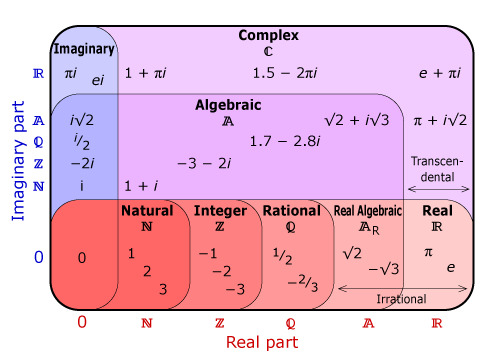

# Álgebra 3o y 4o enseñanza media

## Preliminares

### Definición

La palabra álgebra se deriva de una voz árabe que significa **reducción**. Esta definición etimológica se acomoda muy bien al álgebra, de la cual se dice que es una ciencia cuyo objeto es la **simplificación** y **generalización** de todas las cuestiones relacionadas con las cantidades.

### Símbolos

Generalmente, se reservan las primeras letras del alfabeto para indicar cantidades conocidas, mientras que las últimas se utilizan para las cantidades desconocidas o incógnitas.

## Unidad I (los números)

### Valor absoluto y valor relativo de los números

- Valor absoluto: es el valor aritmético de dicho número haciendo caso omiso del signo correspondiente.

- Valor relativo: es el valor aritmético de dicho número tomado con el signo correspondiente.

### Números opuestos o simétricos

Son un par de números algebraicos que tienen el mismo valor absoluto, pero difieren en valor relativo.

### Numeros racionales e irracionales

- Numero racional: puede expresarse como el cociente de dos enteros.

- Numero irracional: **no** puede expresarse como el cociente de dos enteros.

Obviamente, el significado semántico de los vocablos racional e irracional no se acomoda en manera alguna a los números aquí estudiados. Todo se debe a un error de traducción. En efecto, Euclides al clasificar sistemáticamente los números los dividió en dos grandes grupos que llamo **symmetros** (con medida) y **asymmetros** (sin medida) respectivamente. Y para señalar el hecho de que los números asymmetros no tenían expresión, los designo con la voz **alogos**. Gerardo de Cremona (1114 - 1187) al traducir un comentario árabe sobre Euclides, tomo los vocablos logos y alogos en su acepción de **razón** y no la de **palabra**, como quiso Euclides, y empleo erróneamente los términos **rationalis** e **irrationalis** para designar unos y otros. Este error se difundió durante toda la edad media hasta llegar a nosotros.

## Unidad II (adicción)

### La sustracion algebraica

Para restar un número de otro basta cambiar el signo al número que se va a restar y colocarlo con el nuevo signo enseguida del otro, como en el caso de una suma.

> Obsérvese que después de cambiar el signo al número que se va a restar, todo se reduce a una suma algebraica.

### Leyes de la adicción

1. Ley conmutativa: si $a + b = k$ también $b + a = k$; o $a + b = b + a$; es decir, que los términos se pueden intercambiar sin que se altere el resultado de la adicción.

2. Ley asociativa: si $(a + b) + c = k$, también $a + (b + c) = k$ o $(a + b) + c = a + (b + c)$.

3. Ley de identidad: para cualquier valor de $a$ hay un número y solo uno tal que $a + k = 0$. Tal número $k$ es $0$. Por esta razón, el $0$ recibe el nombre de módulo de la suma o elemento identidad.

## Unidad III (multiplicacion y division)

### Ley conmutativa y ley asociativa

- Ley conmutativa: el orden de los factores no altera el producto.

    $$
    a b = b a
    $$

- Ley asociativa: los factores de un producto pueden ser reagrupados de cualquier modo sin que se altere el producto.

    $$
    a b c = (a b) c = a (b c)
    $$

## Unidad IV (potenciacion y radicacion de enteros)

### Exponente negativo

Veamos como toda cantidad con exponente negativo es una fracción cuyo numerador es uno y su denominador es la misma cantidad elevada a la misma potencia, pero son signo positivo.

$$
\frac{ x^m }{ x^{ m + n } } = x^{ -n } \\[10 pt]

x^{ m + n } = x^m * x^n \\[10 pt]

\frac{ x^m }{ x^{ m + n } } = \frac{ x^m }{ x^m * x^n } = \frac{ 1 }{ x^n }\\[10 pt]

\therefore x^{ -n } = \frac{ 1 }{ x^n }
$$

## Unidad V (expresiones algebraicas)

### La expresión algebraica

Es la representación de una o varias operaciones matemáticas por medio de símbolos. Esto nos lleva a las fórmulas que nos sirven para **generalizar** operaciones matemáticas.

### Termino y sus partes

- Termino: es una expresión algebraica que consta de números y símbolos no separados por los signos $+$ o $-$.
    $$
    a \quad 2 a^2 \quad -12 a b
    $$

### Grado de un término

- Grado absoluto: es la suma de los exponentes de los factores literales.

    $$
    5 a^3 b^2 \quad \text{ Grado $5$ }
    $$

- Grado relativo: con respecto a una letra es el exponente de dicha letra.

    $$
    5 a^3 b^2 \quad \text{ Grado $3$ con respecto a $a$ }
    $$

### Grado de un polinomio

- Grado absoluto: es igual al grado del término que tenga mayor grado.

    $$
    a x + x^4 b^2 - b x^3 + 10 a^2 x^3 \quad \text{ Grado $6$ }
    $$

- Grado relativo: con respecto a una letra es al mayor exponente que tenga dicha letra en el polinomio.

    $$
    a x + x^4 b^2 - b x^3 + 10 a^2 x^3 \quad \text{ Grado $4$ con respecto a $x$  }
    $$

## Unidad VI (adiccion y sustraccion de expresiones algebraicas. Ecuaciones. Inecuaciones)

### Igualdad, identidad. Ecuación

- Igualdad: expresión matemática de dos cantidades que tienen un mismo valor.

- Identidades: igualdad que contiene una o varias cantidades desconocidas llamadas incógnitas que se cumple para cualquier valor que se le dé a las letras.

    $$
    a + b \equiv a + b \\[10 pt]

    x^2 - y^2 \equiv (x + y) (x - y)
    $$

- Ecuación: igualdad que contiene una o varias cantidades desconocidas llamadas incógnitas.

Se llama **primer miembro** de una igualdad o identidad a la expresión que está antes del signo de igualdad y **segundo miembro** a la expresión que va después de dicho símbolo.

Según lo anterior podemos afirmar que toda identidad y ecuación es una igualdad; más no así los recíprocos.

### Grado de una ecuación

Lo determina el término en que la suma de los exponentes de las incógnitas sea máxima.

$$
a^4 x^3 + 2 b x = c \quad \text{ Grado $3$ }
$$

### Principios generales de las ecuaciones

La igualdad subsiste si a los dos miembros de una ecuación se:

- suma o se resta una misma cantidad.

- multiplican o dividen por una misma cantidad.

- elevan a una misma potencia o se les extrae la misma raíz.

### Desigualdades

Llamamos como en las igualdades **primer miembro** a la expresión que está a la izquierda del signo de desigualdad y **segundo miembro** a la expresión que está a la derecha de dicho signo.

#### Propiedades de las desigualdades

- La desigualdad no varía si a los dos miembros de la desigualdad se:

    - suma o resta una misma cantidad.

    - multiplica o divide por una misma cantidad positiva.

- La desigualdad cambia de sentido si a los dos miembros de la desigualdad se:

    - multiplica o divide por una misma cantidad negativa.

    - cambian por sus inversos.

- Si los miembros de una desigualdad son positivos y se elevan a una misma potencia positiva, la desigualdad permanece.

- Si los dos miembros de una desigualdad, o uno de ellos, son negativos y se elevan a una misma potencia impar positiva, la desigualdad permanece.

- Si ambos miembros de una desigualdad, son negativos y se elevan a una misma potencia par positiva, la desigualdad cambia de signo.

- Si los miembros de una desigualdad tienen diferente signo y se elevan a una misma potencia par positiva, la desigualdad **puede** cambiar de signo.

- Si los miembros de una desigualdad son positivos y se les extrae una misma raíz positiva, la desigualdad permanece.

- Si dos o más desigualdades de igual signo se multiplican o suman miembro a miembro, resulta una desigualdad del mismo signo.

- Al restar o dividir miembro a miembro dos desigualdades de igual signo **puede** resultar una igualdad o una desigualdad de diferente signo.

### Inecuaciones

Las desigualdades que contienen una o varias cantidades desconocidas. Las inecuaciones solo se satisfacen para ciertos valores de las incógnitas, por ello se llaman también **desigualdades de condición**.

#### Inecuaciones simultáneas

Aquellas que inecuaciones que tiene una solución común.

## Unidad VII (multiplicación de expresiones algebraicas)

### Ordenación de polinomios

Se dice que un polinomio está ordenado con respecto a una letra cuando los exponentes de dicha letra, llamada **ordenatriz**, van en orden ascendente o descendente.

### Productos notables

Hay ciertos productos que por su simplicidad y por obedecer a reglas fijas se llaman notables y son de la forma $(x \pm y)^2$ y $(x + y)(x - y)$.

1. $(x + y)^2$.

    $$
    \begin{array}{rcl}
        (x - y)^2 & = & (x + y) (x + y)       \\[5 pt]
                  & = & x^2 + x y + x y + y^2 \\[5 pt]
                  & = & x^2 + 2 x y + y^2      \\
    \end{array}
    $$

2. $(x - y)^2$.

    $$
    \begin{array}{rcl}
        (x - y)^2 & = & (x - y) (x - y)       \\[5 pt]
                  & = & x^2 - x y - x y + y^2 \\[5 pt]
                  & = & x^2 - 2 x y + y^2      \\
    \end{array}
    $$

3. $(x + y) (x - y)$.

    $$
    \begin{array}{rcl}
    (x + y) (x - y) & = & x^2 + x y - x y + y^2 \\[5 pt]
                    & = & x^2 - y^2
    \end{array}
    $$

## Unidad VIII (división de expresiones algebraicas)

### División de polinomios

Para dividir un polinomio por otro:

1. Se ordena el polinomio con relación a una letra en orden decreciente.

2. El primer término del cociente resulta de dividir el primer término del dividendo por el primero del divisor.

3. Este primer término del cociente se multiplica por el divisor y el producto se resta del dividendo.

Se repiten estos pasos sucesivamente hasta que el resto sea cero.

### Teorema del residuo. División de un polinomio en $x$ por otro de la forma $(x \pm a)$

Se dice que un polinomio es entero en $x$ cuando todos los exponentes de dicha letra son positivos y enteros.

#### Enunciado

El residuo de la división de un polinomio entero en $x$ por un binomio de la forma $(x \pm a)$ se obtiene reemplazando el polinomio $x$ por $a$, o por $-a$.

En general, si tenemos un polinomio $a x^m + b x^{ m - 1 } + c x^{ m - 2 } + \dots$ dividido por $(x - a)$; y llamamos $Q$ al cociente y $R$ al residuo, luego:

$$
a x^m + b x^{ m - 1 } + c x^{ m - 2 } + \dots = (x - a) Q + R
$$

Reemplacemos $x$ por $a$.

$$
a a^m + b a^{ m - 1 } + c a^{ m - 2 } + \dots = (a - a) Q + R \\[10 pt]

a a^m + b a^{ m - 1 } + c a^{ m - 2 } + \dots = R \\[10 pt]
$$

> Si el divisor es de la forma $(x + a)$ se remplaza $x$ por $-a$.

### Regla de los coeficientes o de Ruffini

$$
{ b x^3 + c x^2 + dx + e } : { x - a }
$$

Si $b_1 x^3 + c_1 x^2 + d_1$ y $R$ son el cociente y el residuo respectivamente resultantes de la división anterior.

$$
\begin{array}{rcl}
    b x^3 + c x^2 + dx + e & = & (b_1 x^3 + c_1 x^2 + d_1) (x - a) + R \\[5 pt]

                           & = & b_1 x^3 + (c_1 a b_1) x^2 + (d_1 - a c_1) x - a d_1 + R
\end{array}
$$

Para que la igualdad anterior sea válida es necesario que los coeficientes de las mismas potencias de $x$ sean iguales.

$$
\begin{array}{rcl}
    b & = & b_1 \\[5 pt]

    c & = & c_1 a b_1 \\[5 pt]

    d & = & d_1 - a c_1 \\[5 pt]

    e & = & -a d_1 + R
\end{array}
$$

De aquí podemos despejar los coeficientes del cociente y el residuo.

$$
\begin{array}{rcl}
    b_1 & = & b \\[5 pt]

    c_1 & = & c + a b_1 \\[5 pt]

    d_1 & = & d + a c_1 \\[5 pt]

    R & = & e + a d_1
\end{array}
$$

Esta es la regla de Ruffini para los coeficientes.

1. El primer coeficiente es igual al primero del dividendo.

2. Cualquier otro coeficiente es igual a su correspondiente del dividendo más el producto entre $a$ y el coeficiente inmediatamente anterior del cociente.

3. El resido es igual al último coeficiente del dividendo más el producto entre $a$ y el coeficiente anterior del cociente.

Tanto en el dividendo como en el cociente pueden no estar todas las potencias de $x$, por ello es conveniente adoptar un método que evite confusiones en el cálculo de los coeficientes aplicando la regla de Ruffini. Quizás el más claro sea el de emplear como subíndices las presuntas potencias de $x$ en el cociente, las cuales empiezan por $n - 1$, siendo $n$ la potencia mayor del dividendo.

### Divisibilidad de $x^n \pm a^n$ por $x \pm a$

> Usando el teorema del residuo.

- $x^n - a^n$ siempre es divisible por $x - a$.

    Al reemplazar $x$ por $a$ se anula el polinomio.

    $$
    x^n - a^n = a^n - a^n = 0
    $$

- $x^n - a^n$ es divisible por $x + a$ solo cuando $n$ es par.

    Al reemplazar $x$ por $-a$.

    $$
    x^n - a^n = (-a)^n - a^n
    $$

- $x^n + a^n$ es divisible por $x + a$ solo cuando $n$ es impar.

    Al reemplazar $x$ por $-a$.

    $$
    x^n + a^n = (-a)^n + a^n
    $$

- $x^n + a^n$ nunca es divisible por $x - a$.

    No hay valor posible bajo ninguna circunstancia que haga que $x^n + a^n$ sea $0$.

    > Ni par, ni impar.

## Unidad IX (potenciación)

### Binomio de Newton

Sea un binomio de la forma $(a \pm b)^n$.

1. El número de términos es igual al exponente más uno o $n + 1$.

2. Los exponentes de $a$ van en orden descendente desde $n$ hasta $0$ y los de $b$ van en orden creciente desde $0$ hasta $n$.

3. La suma de los exponentes de $a$ y $b$ en cualquier término es igual $n$.

4. El coeficiente del primer término es $1$ y el del segundo término es igual al exponente del binomio.

5. Los demás coeficientes se obtienen multiplicando el coeficiente del término anterior por el exponente de $a$ en dicho término y dividiendo el producto por el exponente de $b$ en el mismo término aumentado en $1$.

6. Todos los signos del desarrollo $(a + b)^n$ son positivos; el desarrollo de $(a - b)^n$ tiene signos alternados empezando por positivo.

En general, el coeficiente de cualquier término es igual al producto de todos los exponentes de $a$ en los términos anteriores, dividido por el factorial del exponente de $b$ en dicho término.
$$
(a + b)^n = a^n + n a^{ n - 1 } b + \frac { n (n - 1) a^{ n - 2 } b^2 }{ 2! } + \dots + n a b^{ n - 1 } + b^n
$$

### Cuadrado de un polinomio

Sea un polinomio $p$ en el desarrollo de su cuadrado ($p^2$) se cumple lo siguiente:

1. El desarrollo contiene el cuadrado de todos y cada uno de los terminos del polinomio siempre con signo positivo.

2. Luego aparecen en el desarrollo todos los dobles productos de las posibles combinaciones binarias que pueden hacerse entre los terminos del polinomio.

3. Los signos de los dobles productos depende del que tengan sus terminos en el polinomio, de acuerdo con las leyes de la multiplicacion.

## Unidad X (factorización)

### Factorización por inspección

Los trinomios de la forma $x^2 + b x + c$ se pueden factorizar si son divisibles por un factor de la forma $x \pm a$; $a$ debe ser divisor del término independiente $c$. La manera de buscar ese factor es una inspección...

La inspección se compone de los siguientes pasos:

1. El primer término del primer factor es la raíz cuadrada del primer término del trinomio.

2. Una vez seleccionados los factores del término independiente, se estudia el signo: si es positivo en el trinomio, los factores deben ser ambos positivos o ambos negativos; si es negativo el término independiente del trinomio, uno de sus factores es positivo y el otro negativo.

3. El coeficiente del segundo término del trinomio es la suma algebraica de los factores del término independiente.

$$
x^2 \pm (a \pm b) x \pm a b = (x \pm a) (x \pm b)
$$

### Trinomios de la forma $a x^2 + b x + c$

$$
\begin{array}{rcl}
    a x^2 + b x + c & = & (d x + e) (f x + g) \\[5 pt]

                    & = & d f x^2 + d g x + e f x + e g \\[5 pt]

                    & = & d f x^2 + (d g + e f) x + e g \\[5 pt]
\end{array}
$$

...en este caso se buscan dos factores de $a$ que se ponen como coeficientes de $x$ ($d f$). Luego se estudian los factores del término independiente ($c$), de tal manera que el coeficiente del segundo término del trinomio sea la suma algebraica de los productos de cada uno de estos factores ($d g + e f$).

### Máximo común divisor (MCD)

El máximo común divisor de dos o más expresiones algebraicas es la expresión algebraica de mayor grado que las divide a todas sin dejar residuo.

#### MCD por divisiones sucesivas

Para encontrar el MCD de dos polinomios se ordenan ambos con relación a una misma letra, luego se divide el uno por el otro tomando como divisor al de menor grado; si ambos tienen el mismo grado es indiferente cuál se tome como divisor. Si la división no deja residuo, el divisor es el MCD; si deja residuo se divide el divisor por este residuo y así sucesivamente hasta que la división sea exacta. El último divisor es el MCD buscado.

> Algoritmo de Euclides.

Para la practica de este metodo se deben seguir las siguientes reglas:

1. Si se obtiene un residuo cuyo primer termino es negativo, pueden multiplicarse por $-1$ todos los términos de ese residuo.

2. Si el primer término del dividendo no es divisible por el primero del divisor, se pueden multiplicar todos los términos del dividendo por la cantidad necesaria para hacerlo divisible. Esta misma regla se aplica a los residuos. El residuo de cualquier división se puede dividir por un factor que no sea común a los polinomios.

### Mínimo común múltiplo (MCM)

El MCM de dos o más expresiones algebraicas es la expresión algebraica de menor grado y mínimo coeficiente que es divisible por cada una de las expresiones dada.

Para hallar el MCM de varias expresiones algebraicas se descomponen todas y cada una en sus factores primos; el producto de los factores primos comunes y no comunes tomados con su mayor exponente es el MCM de las expresiones dadas.

## Unidad XII (ecuaciones fraccionarias de primer grado y razones y proporciones)

### Ecuacion fraccionaria

Una ecuacion es fraccionaria cuando la incognita aparece una o mas veces en el denominador.

### Transformacion de ecuaciones fraccionaria a enteras

#### Teorema (transformacion de ecuaciones fraccionaria a enteras)

Si dos miembros de una ecuación se multiplican por una misma cantidad entera, se obtiene una nueva ecuación que contiene todas las raíces de la primera, pero además puede contener otras nuevas raíces, llamadas raíces extrañas, puesto que no pertenecen a la ecuación original. En general, si se multiplica por una expresión $p(x)$, la nueva ecuación también tendrá las raíces de $p$.

> No se pierden las soluciones, mas como se han introducido raíces extrañas es necesario, una vez resuelta la ecuación transformada, verificar todas las raíces encontradas para desechar las que no satisfacen la ecuación original.

### Valor de una fracción de la forma $\frac{ 0 }{ 0 }$

Si los miembros de una fracción se anulan para un valor de $x = a$ es porque ambos son divisibles por $x - a$, de acuerdo con el teorema del residuo. Por tanto, para encontrar el verdadero valor de una fracción, cuando esta se anula para un valor $x = a$, se simplifica dividiendo numerador y denominador por $x - a$ tantas veces sea necesario.

### Razones y proporciones

Se llama razón de dos cantidades el cociente resultante de dividir la una por la otra. Por tanto, una división indicada es una razón. Así:

$$
\frac{ a }{ b }, \frac{ x }{ y }, \frac{ a + x }{ b + y }
$$

son razones y se leen de la siguiente forma:

$a$ es a $b$, $x$ es a $y$ y $a + x$ es a $b + y$, respectivamente. En las razones se da el nombre de antecedente al numerador o primer termino y consecuente al denominador o segundo termino.

Se llama **proporción** a la igualdad de dos razones...

### Propiedades de las proporciones

1. En una proporción se puede sumar o restar a cada antecedente su consecuente sin que se altere la igualdad.

    $$
    \frac{ a }{ b } = \frac{ c }{ d } \implies \frac{ a \pm b }{ b } = \frac{ c a \pm d }{ d }
    $$

    En efecto:

    $$
    \frac{ a }{ b } \pm 1 = \frac{ c }{ d } \pm 1 \quad \frac{ a \pm b }{ b } = \frac{ c a \pm d }{ d }
    $$

2. Cuando se tienen dos o más razones iguales, la suma o la diferencia de los antecedentes dividida por la suma o diferencia de los consecuentes forma otra razón que es igual a las primeras.

    $$
    \frac{ a }{ b } = \frac{ c }{ d } = \frac{ f }{ g } = \frac{ a \pm c \pm f }{ b \pm d \pm g }
    $$

    En efecto:

    $$
    \frac{ a }{ b } = \frac{ c }{ d } = \frac{ f }{ g } = k \\[10 pt]

    a = b k \quad c = d k \quad f = g k \quad a \pm c \pm f = k (b \pm d \pm g) \\[10 pt]

    \frac{ a \pm c \pm f }{ b \pm d \pm g } = k = \frac{ a }{ b } = \frac{ c }{ d } = \frac{ f }{ g }
    $$

3. Cuando se tiene la igualdad de dos razones, la suma de los antecedentes dividida por la suma de los consecuentes es igual a la razón formada por las diferencias de los mismos.

    $$
    \frac{ a }{ b } = \frac{ c }{ d } \implies \frac{ a + c }{ b + d } = \frac{ a - c }{ b - d }
    $$

    > Usando la segunda propiedad se puede demostrar.

## Unidad XIII (raíces y ecuaciones con radicales)

### Raiz enesima de una expresion algebraica

Distingamos todas las partes de la expresión algebraica $\sqrt[ n ]{ a }$. En primer lugar, $\sqrt{ }$ es el símbolo llamado **radical** que se utiliza para indicar la operación de radicación; $n$ es el **índice** que indica el grado de la radicación, suele omitirse cuando $n = 2$ o sea raíz cuadrada; $a$ es la cantidad llamada **subradical** y representa la expresión a la cual se va a extraer la raíz del grado indicado por el índice.

### Cantidades imaginarias

Toda expresion de la forma $\sqrt[ n ]{ -x }$, en que $n$ es par puede reducirse a una cantidad real multiplicada por la unidad imaginaria.

$$
n = 2 k \; k \in \mathbb{ N } \implies \sqrt[ n ]{ -x } = \sqrt[ n ]{ x } \sqrt{ -1 }
$$

### Cantidades racionales e irracionales

Se dice que una cantidad es racional cuando se le puede extraer la raiz indicada exactamente. De lo contrario se dice de esa cantidad que es irracional.

### Reduccion de radicales a un indice comun

Para reducir dos o más expresiones radicales con distinto índice a un índice común, se halla el MCM de los índices, que servirá de índice común, luego se multiplican los exponentes de las cantidades subradicales de cada radical por el cociente de dividir el MCM por el índice correspondiente.

### Racionalizacion

Por definición, fracción irracional es aquella en la cual sus dos términos o uno de ellos contiene un radical.

Para racionalizar el denominador de una fracción irracional se multiplican el numerador y denominador por un factor tal que haga racional dicho denominador.

## Unidad XIV (concepto de función y funciones lineales)

### Variación directa e inversa

Se dice que dos variables está en una relación directa cuando al multiplicar o dividir una de ellas por una cantidad, la otra queda multiplicada o dividida por esa misma cantidad...

Se dice que dos variables están en relación inversa cuando al multiplicar o dividir una de ella por una cantidad, la otra queda dividida o multiplicada, respectivamente, por esa misma cantidad...

$$
y = \frac{ k }{ x }
$$

Donde $y$ es la medida de cualquier cantidad de la segunda magnitud y $x$ la correspondiente medida de la primera magnitud. $k$ es la constante de proporcionalidad.

### Representación gráfica de las funciones

Las coordenadas de un punto se llaman **abscisa** a la distancia paralela al eje de las equis y **ordenada** a la distancia paralela al eje de las yees.

Si la función es de la forma $y = a x$, es decir, carece de término independiente, la línea que ella representa pasa por el origen. Si la función es de la forma $y = a x + b$, es decir, tiene un término independiente ($b$), la línea que ella representa no pasa por el origen de los ejes coordenados. Su desplazamiento sobre el eje de las yees es igual al término independiente.

### Ecuaciones simultáneas con dos incógnitas

...La naturaleza de las ecuaciones determina el método más aconsejable que se debe seguir. Estos métodos son:

1. Eliminación por sustitución: consiste en despejar de una de las ecuaciones la incógnita de se quiera eliminar y reemplazar su valor en la segunda ecuación.

2. Eliminación por comparación: llamado también de igualación, consiste en despejar la misma incógnita en las dos ecuaciones y luego igualar los valores obtenidos.

3. Eliminación por reducción: consiste en igualar los coeficientes de una incógnita en ambas ecuaciones y luego se suman algebraicamente en forma tal que se elimine dicha incógnita.

## Unidad XV (sistemas de ecuaciones simultáneas y determinantes)

### Determinantes

#### Definición (determinantes)

Sea el siguiente sistema de ecuaciones

$$
\begin{array}{cccc}
    a_1 x + b_1 y & = & k_1 & (1) \\[5 pt]
    a_2 x + b_2 y & = & k_2 & (2) \\[5 pt]
\end{array}
$$

Multipliquemos la ecuación $(1)$ por $b_2$ y la $(2)$ por $b_1$.

$$
\begin{array}{cccc}
    a_1 b_2 x + b_1 b_2 y & = & b_2 k_1 & (3) \\[5 pt]
    a_2 b_1 x + b_1 b_2 y & = & b_1 k_2 & (4) \\[5 pt]
\end{array}
$$
Si restamos la $(4)$ de la $(3)$, tenemos:

$$
a_1 b_2 x - a_2 b_1 x = b_2 k_1 - b_1 k_2 \quad x = \frac{ b_2 k_1 - b_1 k_2 }{ a_1 b_2 - a_2 b_1 }
$$

Multipliquemos ahora la ecuación $(1)$ por $a_2$ y la $(2)$ por $a_1$.

$$
\begin{array}{cccc}
    a_1 a_2 x + a_2 b_1 y & = & a_2 k_1 & (5) \\[5 pt]
    a_1 a_2 x + a_1 b_2 y & = & a_1 k_2 & (6) \\[5 pt]
\end{array}
$$

Si restamos la $(5)$ de la $(6)$, tenemos:

$$
a_1 b_2 y - a_2 b_1 y = a_1 k_2 - a_2 k_1 \quad y = \frac{ a_1 k_2 - a_2 k_1 }{ a_1 b_2 - a_2 b_1 }
$$

El denominador común de $x$ y de $y$ ($a_1 b_2 - a_2 b_1$), se puede escribir con la siguiente notación:

$$
a_1 b_2 - a_2 b_1 =
\begin{vmatrix}
    a_1 & b_1 \\[5 pt]
    a_2 & b_2
\end{vmatrix}
$$

La expresión a la derecha del signo igual es por definición un **determinante**.

### Solución de ecuaciones por determinantes

Las soluciones de $x$ y $y$ pueden expresarse por medio de determinantes, así:

$$
x = \frac{
        \begin{vmatrix}
            k_1 & b_1 \\[5 pt]
            k_2 & b_2
        \end{vmatrix}
    }
    {
        \begin{vmatrix}
            a_1 & b_1 \\[5 pt]
            a_2 & b_2
        \end{vmatrix}
    }
\quad
y = \frac{
        \begin{vmatrix}
            a_1 & k_1 \\[5 pt]
            a_2 & k_2
        \end{vmatrix}
    }
    {
        \begin{vmatrix}
            a_1 & b_1 \\[5 pt]
            a_2 & b_2
        \end{vmatrix}
    }
$$

### Determinantes de tercer orden y regla de Sarrus

Si tenemos un determinante de tercer orden de la forma:

$$
\begin{vmatrix}
    a_1 & b_1 & c_1 \\[5 pt]
    a_2 & b_2 & c_2 \\[5 pt]
    a_3 & b_3 & c_3
\end{vmatrix}
$$

y queremos encontrar los productos formados por las diagonales, nos valemos de una sencilla regla llamada "regla de Sarrus" que consiste en repetir debajo de la tercera fila las dos primeras filas horizontales.

$$
\begin{vmatrix}
    a_1 & b_1 & c_1 \\[5 pt]
    a_2 & b_2 & c_2 \\[5 pt]
    a_3 & b_3 & c_3 \\[5 pt]
    a_1 & b_1 & c_1 \\[5 pt]
    a_2 & b_2 & c_2
\end{vmatrix}
$$

El desarrollo del determinante es:

$$
(a_1 b_2 c_3 + a_2 b_3 c_1 + a_3 b_1 c_2) - (a_3 b_2 c_1 + a_1 b_3 c_2 + a_2 b_1 c_3)
$$

### Solución de ecuaciones de tercer grado y regla de Kramen

Sea el siguiente sistema de ecuaciones:

$$
\begin{array}{ccc}
    a_1 x + b_1 y + c_1 z & = & k_1 \\[5 pt]
    a_2 x + b_2 y + c_2 z & = & k_2 \\[5 pt]
    a_3 x + b_3 y + c_3 z & = & k_3
\end{array}
$$

la regla de Krames establece lo siguiente:

$$
x = \frac{
        \begin{vmatrix}
            k_1 & b_1 & c_1 \\[5 pt]
            k_2 & b_2 & c_2 \\[5 pt]
            k_3 & b_3 & c_3
        \end{vmatrix}
    }
    {
        \begin{vmatrix}
            a_1 & b_1 & c_1 \\[5 pt]
            a_2 & b_2 & c_2 \\[5 pt]
            a_3 & b_3 & c_3
        \end{vmatrix}
    }
\quad
y = \frac{
        \begin{vmatrix}
            a_1 & k_1 & c_1 \\[5 pt]
            a_2 & k_2 & c_2 \\[5 pt]
            a_3 & k_3 & c_3
        \end{vmatrix}
    }
    {
        \begin{vmatrix}
            a_1 & b_1 & c_1 \\[5 pt]
            a_2 & b_2 & c_2 \\[5 pt]
            a_3 & b_3 & c_3
        \end{vmatrix}
    }
\quad
z = \frac{
        \begin{vmatrix}
            a_1 & b_1 & k_1 \\[5 pt]
            a_2 & b_2 & k_2 \\[5 pt]
            a_3 & b_3 & k_3
        \end{vmatrix}
    }
    {
        \begin{vmatrix}
            a_1 & b_1 & c_1 \\[5 pt]
            a_2 & b_2 & c_2 \\[5 pt]
            a_3 & b_3 & c_3
        \end{vmatrix}
    }
$$

### Representación gráfica de un punto en el espacio

...**abscisa** de un punto es la distancia al plano $yz$. **Ordenada** de un punto es la distancia al plano $xz$. **Cota** de un punto es la distancia al plano $xy$.

### Representación gráfica de una ecuación de primer grado con tres incógnitas

Una ecuación de primer grado con tres variables representa un plano. En general, una ecuación de la forma $a x + b y + c z = k$ se representa en el plano indeterminado que pasa por los puntos $(a_1,0,0)$, $(0,b_1,0)$ y $(0,0,c_1)$ en que:

$$
a = \frac{ k }{ a } \quad b = \frac{ k }{ b } \quad c = \frac{ k }{ c }
$$

## Unidad XVI (ecuaciones de segundo grado con una incógnita)

### Ecuaciones de segundo grado

### Ecuación completa (ecuaciones de segundo grado)

Una ecuación de segundo grado es completa si contiene, además de la segunda potencia de la incógnita, la primera potencia de la incógnita y un término independiente.

### Ecuación incompleta (ecuaciones de segundo grado)

Una ecuación de segundo grado es incompleta si carece del término independiente, o de la primera potencia de la incógnita.

### Solucion general

La fórmula general de una ecuación de segundo grado es:

$$
a x^2 + b x + c = 0 \quad a x^2 + b x = -c
$$

Para hacer del primer miembro un cuadrado perfecto, multipliquemos todos los términos de la igualdad por $4 a$ y sumemos $b^2$ a ambos miembros.

$$
4 a^2 x^2 + 4 a b x + b^2 = b^2 - 4 a c \quad (2 a x + b)^2 = b^2 - 4 a c \\[10 pt]

2 a x + b = \pm \sqrt{ b^2 - 4 a c } \quad x = \frac{ -b \pm \sqrt{ b^2 - 4 a c } }{ 2 }
$$

Estas raíces pueden ser reales o imaginarias, según que el radicar $\sqrt{ b^2 - 4 a c }$ sea una cantidad real o imaginaria. Esta cantidad recibe el nombre de **discriminante** o **realizante**, ya que de ella depende la "realidad" de las raíces.

## Relación entre las raíces y los coeficientes de la ecuación de segundo grado

Si tenemos la ecuación general de segundo grado:

$$
a x^2 + b x + c = 0
$$

sabemos que sus raíces son:

$$
x_1 = \frac{ -b + \sqrt{ b^2 - 4 a c } }{ 2 } \quad x_2 = \frac{ -b - \sqrt{ b^2 - 4 a c } }{ 2 }
$$

por tanto:

$$
x_1 + x_2 = \frac{ -2 b }{ 2 a } = -\frac{ b }{ a } \quad x_1 x_2 = \frac{ b^2 - (b^2 - 4 a c) }{ 4 a^2 } = \frac{ c }{ a }
$$

...Esta regla permite resolver una ecuación de la forma $x^2 + b x + c = 0$ por simple inspección; es decir, por factorización. En efecto:

$$
x_1 + x_2 = \frac{ -b }{ 1 } = -b \quad x_1 x_2 = \frac{ c }{ 1 } = c
$$

### Representación gráfica de la función $y = a x^2 + b x + c$

Para determinar el valor mínimo de $y$ procedemos así:

$$
y = x^2 + b x + c
$$

Multipliquemos por cuatro todos los términos de la igualdad; luego sumemos y restemos $b^2$ al segundo miembro.

$$
4 y = 4 x^2 + 4 b x + 4 c + b^2 - b^2 \quad y = \frac{ 4 x^2 + 4 b x + 4 c + b^2 - b^2 }{ 4 } = \frac{ (2 x + b)^2 + 4 c - b^2 }{ 4 }
$$

El valor mínimo de la fracción depende del término $(2 x + b)^2$ donde aparece la variable $x$. $(2 x +b)^2$ no puede ser negativo, por tanto, su valor mínimo es $0$.

$$
2 x + b = 0 \quad x = \frac{ -b }{ 2 }
$$

Asi el valor minimo de $y$ es $\frac{ 4 c - b^2 }{ 4 }$.

En el caso de una ecuación de la forma $-x^2 + b x + c$, se procede de una forma similar, pero se llega a los siguientes resultados:

$$
x = \frac{ b }{ 2 } \quad y = \frac{ 4 c + b^2 }{ 4 }
$$

> Este en el caso en el que el vortice es maximo.

## Unidad XVII (análisis gráfico de la ecuación de segundo grado)

### Parábola

#### Elipse

La representación gráfica de una ecuación de la forma $a x^2 + b y^2 = c$ es una elipse.

### Circunferencia

La representacion grafica de una ecuacion de la forma $x^2 + y^2 = k$ es una circunferencia.

### Hipérbola

La representación gráfica de una ecuación de la forma $x y = c$ es una hipérbola.

En la gráfica de una hipérbola puede observarse que a medida que $y$ tiende a cero, la curva crece en valor absoluto en $x$, pero nunca corta el eje de las equis. Lo mismo ocurre con la ordenada $y$, cuando $x$ tiende a cero. En este caso se dice que la curva es asintótica con respecto al eje de referencia y viceversa.

Tanto la curva como el eje reciben el nombre de asíntotas.

### Analisis de la ecuacion completa de segundo grado con dos variables

...una ecuacion de segundo grado con dos variables es de la forma:

$$
a x^2 + b x y + c y^2 + e y + f = 0
$$

Para que la ecuacion sea considerada de segundo grado con dos variables no es necesario que contenga todos los terminos de la forma general, basta que tenga las dos variables y al menos una de ellas sea de segundo grado. O basta con que la ecuacion contenga el producto de las primeras potencias de las dos variables...

Segun ciertas condiciones, podemos clasificar la curva en ciertos generos:

- $b^2 - a c > 0$: hiperbola.

- $b^2 - a c = 0$: parabola.

- $b^2 - a c < 0$: elipse.

## Unidad XIX (números complejos)

### Números imaginarios

En general, toda expresión de la forma $\sqrt{ -b }$, en que $n$ es par y $-b$ una cantidad real negativa, la expresión es imaginaria pura.

Si un número es de la forma $\sqrt{ -b }$, en que $b$ es un número real positivo, es conveniente escribirlo en la forma propia de los números imaginarios, esto es $\sqrt{ b } i$, con esto se facilitan las operaciones que se han de efectuar con tales números.

Se dice que dos números imaginarios son conjugados cuando solo difieren en signo...

Todas las leyes algebraicas establecidas para las cantidades reales pueden ser aplicadas a las imaginarias con una sola excepción y esta excepción es una consecuencia lógica de la definición de unidad imaginaria.

$$
\sqrt{ a } \sqrt{ b } = \sqrt{ a b } \quad a,b \in \mathbb{ R }
$$

Esta propiedad no se cumple para los números imaginarios.

$$
\sqrt{ -a } \sqrt{ -b } = \sqrt{ -a * -b } = \sqrt{ a b }
$$

pero por definición sabemos que:

$$
\sqrt{ -a } \sqrt{ -b } = \sqrt{ a } i \sqrt{ b } i = -\sqrt{ a b }
$$

### Números complejos

La solución general de la ecuación cuadrática $a x^2 + b x + c$ es $m \pm n \sqrt{ p }$, en que tanto $m$, $n$ como $p$ son números reales en cualquier caso, $\sqrt{ p }$ será un número imaginario si $p$ es una cantidad negativa. Por tanto, es necesario tener números de la forma $m + n i$... A esta combinación de números reales con imaginarios se da el nombre de números complejos.

Dos números complejos son conjugados cuando sus partes reales son iguales y sus partes imaginarias son conjugadas...

### Representación gráfica de números complejos

El plano determinado por los ejes cartesianos y que sirve para la representación gráfica de los números complejos recibe el nombre de plano gaussiano en memoria de Federico Gauss...

### Operaciones con los números complejos

#### Division (números complejos)

$$
\frac{ a + b i }{ c + d i } = \frac{ (a + b i) (c - d i) }{ (c + d i) (c - d i) } = \frac{ a c + b d + (b c - a d) i }{ c^2 + d^2 } = \frac{ a c + b d }{ c^2 + d^2 } + \frac{ (b c - a d) i }{ c^2 + d^2 }
$$

## Unidad XX (progresiones aritmeticas)

### Definiciones

#### Serie

Es una sucesión de términos algebraicos formados de acuerdo con una ley...

#### Progresión aritmética

Es una **serie** de términos tales, que cada uno de ellos es igual al inmediatamente anterior, sumado con una cantidad constante llamada **razón** de la progresión.

El símbolo usado para designar las progresiones aritméticas es $\div$ y se coloca al principio de una progresión. Entre cada término y el siguiente se acostumbra a usar un punto.

### Termino cualquiera de una progresion aritmetica

Cualquier término de una progresión aritmética es igual al primero, sumado con el producto de la razón por el número de términos que le anteceden...

$$
\div a_1.a_2.a_3.a_4.a_5.a_6\dots.a_n
$$

$$
a_1 = a \\[10 pt]

a_2 = a + r \\[10 pt]

a_3 = a_2 + r = (a + r) + r = a + 2 r \\[10 pt]

a_4 = a_3 + r = (a + 2 r) + r = a + 3 r \\[10 pt]

a_5 = a_4 + r = (a + 3 r) + r = a + 4 r \\[10 pt]

a_6 = a_5 + r = (a + 4 r) + r = a + 5 r
$$

$$
a_n = a + (n - 1) r
$$

Si se tiene una progresión aritmética limitada, la suma de dos términos equidistantes de los extremos es constante y dicha constante es igual a la suma de los extremos.

En efecto, si tenemos la progresión:

$$
\div a_1.a_2.a_3.a_4.a_5.a_6\dots.a_n
$$

Sea $a_{ n_1 }$ y $a_{ n_2 }$ dos terminos equidistantes.

$$
a_{ n_1 } = a + (n_1 - 1) r \\[10 pt]

a_{ n_2 } = a + (n_2 - 1) r \\[10 pt]

n_1 + n_2 = n + 1 \quad n_2 = n + 1 - n_1
$$

$$
\begin{array}{lcr}
    a_{ n_1 } + a_{ n_2 } & = & (a + (n_1 - 1) r) + (a + (n + 1 - n_1 - 1) r) \\[5 pt]

                          & = & 2 a + (n - 1) r
\end{array}
$$

Comparemos este resultado general con la suma de los extremos.

$$
a_1 + a_n = a + (a + (n - 1) r) = 2 a + (n - 1) r
$$

Como es el mismo, queda comprobado que la suma de dos términos equidistantes de los extremos es constante y dicha constante es igual a la suma de los extremos.

### Suma de una progresión aritmética

La suma de los términos de una progresión aritmética limitada es igual al producto de la semisuma de los extremos por el número de términos.

$$
\begin{array}{lcr}
    S   & = & a_1 + a_2 + \dots + a_n \\[5 pt]

    S   & = & a_n + a_{ n - 1 } + \dots + a_1 \\[5 pt]
    \hline \\[5 pt]

    2 S & = & (a_1 + a_n) + (a_2 + a_{ n - 1 }) + \dots + (a_n + a_1)
\end{array}
$$

Puede observarse que cada binomio es la suma de dos términos equidistante; y esta suma, como vimos, es constante e igual a $a_1 + a_n$. Ahora hay tantos binomios como términos tiene la serie.

$$
S = \frac{ (a_1 + a_n) n }{ 2 }
$$

### Elementos de la progresión aritmética

Si partimos de la formula:

$$
a_n = a_1 + (n - 1) r
$$

podemos despejar cada uno de los elementos de la progresion en funcion de todos los demas.

$$
a_1 = a_n - (n - 1) r \\[10 pt]

r = \frac{ a_n - a_1 }{ n - 1 } \\[10 pt]

n = \frac{ a_n - a_1 + r }{ r }
$$

### Medios aritméticos

Reciben el nombre de medios aritméticos todos los términos que están entre el primero y último término de una progresión aritmética...

Si $a$ y $b$ son dos números, interpólense entre ellos $m$ medios aritméticos.

Para ellos buscamos primero la razón. El número de términos de la progresión será igual a $m + 2 = n$...

$$
r = \frac{ b - a }{ m + 2 - 1 } = \frac{ b - a }{ m + 1 }
$$

### Representación gráfica de la progresión aritmética

Podemos ver la fórmula general de una progresión aritmética $a_n = a_1 + (n - 1) r$ como la ecuación $y = a + b x$, donde $y$ (variable independiente) es en enésimo término de una progresión; $a$ (constante) el primer término de la progresión; $x$ (variable independiente) número de términos que anteceden a $y$ y $b$ (constante) razón de progresión.

## Unidad XXI (progresiones geométricas)

### Definiciones (progresiones geométricas)

Progresión geométrica es una serie de términos tales, que cada uno de ellos es igual al inmediatamente anterior multiplicado por una cantidad constante llamada **razón** de la progresión.

El símbolo usado para designar las progresiones geométricas es $\div\div$; y entre los términos de la progresión se usa el símbolo $:$.

Una progresión geométrica es creciente cuando el valor absoluto de la razón es mayor que $1$ y decreciente cuando el valor absoluto de la razón es menor que $1$.

### Término cualquiera de una progresión geométrica

Un término cualquiera de una progresión geométrica es igual al producto entre el primer término y la razón de la progresión elevada a una potencia igual al número de términos que anteceden...

$$
\div\div a_1:a_2:a_3\dots:a_n
$$

Según la definición podemos escribir:

$$
a_1 = a \\[10 pt]

a_2 = a_1 r = a r \\[10 pt]

a_3 = a_2 r = a r^2 \\[10 pt]

a_n = a r^{ n - 1 }
$$

### Términos equidistantes de los extremos

Si se tiene una progresión geométrica limitada, el producto de dos términos equidistantes de los extremos es contante y es igual al producto de dichos extremos. En efecto, si tenemos la progresión:

$$
\div\div a_1:a_2:a_3:a_4:a_5:a_6\dots:a_n
$$

Sea $a_{ n_1 }$ y $a_{ n_2 }$ dos términos equidistantes.

$$
a_{ n_1 } = a r^{ n_1 - 1 } \\[10 pt]

a_{ n_2 } = a r^{ n_2 - 1 } \\[10 pt]

n_1 + n_2 = n + 1 \quad n_2 = n + 1 - n_1
$$

$$
\begin{array}{lcr}
     a_{ n_1 } * a_{ n_2 } & = & (a r^{ n_1 - 1 }) * (a r^{ n + 1 - n_1 - 1 }) \\[5 pt]

                           & = & a^2 r^{ n - 1 }
\end{array}
$$

Comparemos este resultado general con el producto de los extremos.

$$
a_1 * a_n = a * a r^{ n - 1 } = a^2 r^{ n - 1 }
$$

Como es el mismo, queda comprobado que el producto de dos términos equidistantes de los extremos es contante y es igual al producto de dichos extremos.

Cuando el número de términos es de una progresión es impar, el término central es igual a la raíz cuadrada del producto de los extremos.

### Suma de una progresion geometrica

La suma de una progresion geometrica es igual a la diferencia entre el producto del ultimo termino y la razon menos el primer termino, dividida por la diferencia de la razon y uno.

$$
\div\div a_1:a_2:\dots:a_n
$$

$$
S = a_1 + a_2 + \dots + a_n \quad (1) \\[10 pt]

S r = a_1 r + a_2 r + \dots + a_n r \quad (2)
$$

Restamos $(2)$ con $(1)$.

$$
\begin{array}{lcr}
    S r     & = & a_1 r + a_2 r + \dots + a_n r \\[5 pt]

    S       & = & a_1 + a_2 + \dots + a_n  \\[5 pt]

    \hline \\[5 pt]

    S r - S & = & a_n r - a
\end{array}
$$

$$
S = \frac{ a_n r - a }{ r - 1 }
$$

### Suma de una progresion geometrica decreciente infinita

La suma de una progresion geometrica decreciente tiene un limite.

$$
S = \frac{ a_n r - a }{ r - 1 } = \frac{ a r^{ n - 1 } r - a }{ r - 1 } = \frac{ a }{ 1 - r } (1 - r^n)
$$

$$
\lim_{ n \to \infty } { \frac{ a }{ 1 - r } (1 - r^n) } = \frac{ a }{ 1 - r }
$$

### Elementos de la progresion geometrica

$$
a = \frac{ x }{ r^{ n - 1 } } \\[10 pt]

r = \sqrt[ n - 1 ]{ \frac{ x }{ a } } \\[10 pt]

n = \frac{ \log x - \log a }{ \log r } - 1
$$

### Medios geométricos

Reciben el nombre de medios aritméticos todos los términos que están entre el primero y último término de una progresión geométrica...

Si $a$ y $b$ son dos números, interpólense entre ellos $m$ medios geométricos.

Para ellos buscamos primero la razón. El número de términos de la progresión será igual a $m + 2 = n$...

$$
r = \sqrt[ n - 1 ]{ \frac{ x }{ a } } = \sqrt[ m + 1 ]{ \frac{ b }{ a } }
$$

### Fracción decimal periódica

Si tenemos una fracción decimal de la forma:

$$
0.\bar{ a } = \sum_{ i = \operatorname{ digts }(a) }^\infty { \frac{ a }{ 10^i } }
$$

podemos afirmar que se trata de la suma de una progresión geométrica decreciente infinita, cuya generatriz es la siguiente:

$$
S = \frac{ \frac{ a }{ 10^{ \operatorname{ digts }(a) } } }{ 1 - \frac{ 1 }{ 10^{ \operatorname{ digts }(a) } } }
$$

### Representación gráfica de la progresión geométrica

$a_n = a r^{ n - 1 }$, en que $a_n$ es el último término o enésimo término de la progresión geométrica, $a$ el primer término, $r$ la razón y $n$ el número de términos, nos permite asimilarla a una función de la forma $y = a b^x$, en que $y$, como enésimo término de la progresión, es la variable dependiente; $a$ y $b$ son constantes y representan respectivamente el primer término y la razón; $x$ es la variable independiente y representa el número de términos que le anteceden a $y$.

## Unidad XXII (logaritmos)

### Definición (logaritmos)

Logaritmo de un número es el exponente a que hay que elevar otro número llamado **base** para obtener dicho número...

### Logaritmos vulgares o de Briggs

Siendo pues ilimite el sistema de números positivos, también lo es el número de sistemas de logaritmos. No obstante, los sistemas generalmente usados en matemáticas se reducen a dos: el vulgar, llamado también de Briggs, cuya base es $10$; y el sistema de logaritmos naturales o neperianos, cuya base es el número de Euler.

### Propiedades generales de los algoritmos

1. La base de un sistema de logaritmos es siempre positiva. En efecto, si fuera negativa, sus potencias pares serían positiva y sus potencias impares serían negativas, lo cual originaria un sistema de números alternativamente positivo y negativos y, por tanto, habría números positivos sin logaritmo.

2. Los números negativos no tienen logaritmo. Esto es una consecuencia de la propiedad anterior, pues siendo la base positiva todas sus potencias son positivas.

3. En todo sistema de logaritmos, el logaritmo de $1$ es $0$...

4. En todo sistema de logaritmos, el logaritmo de la base es $1$.

5. Como consecuencia de la propiedad $3$ los números mayores que $1$ tienen logaritmo positivo; y los números menores que $1$, tiene logaritmo negativo.

### logaritmación de las operaciones indicadas

1. El logaritmo de un producto es igual a la suma de los logaritmos de sus factores.

    $$
    \log { A B } = \log A + \log B
    $$

    En efecto; si

    $$
    A = b^x \quad \log A = x \\[10 pt]

    B = b^y \quad \log B = y \\[10 pt]
    $$

    $$
    A B = b^x b^y = b^{ x + y } \\[10 pt]

    \log { A B } = x + y = \log A + \log B
    $$

2. El logaritmo de un cociente es igual a la diferencia entre el logaritmo del dividiendo y el logaritmo del diviror.

    $$
    \log \frac{ A }{ B } = \log A - \log B
    $$

    En efecto; si

    $$
    A = b^x \quad \log A = x \\[10 pt]

    B = b^y \quad \log B = y \\[10 pt]
    $$

    $$
    \frac{ A }{ B } = \frac{ b^x }{ b^y } = b^{ x - y }  \\[10 pt]

    \log \frac{ A }{ B } = x - y = \log A - \log B
    $$

3. El logaritmo de una potencia es igual al producto del exponente por el logaritmo de la base.

    $$
    \log A^n = n \log A
    $$

    En efecto; si

    $$
    A = b^x \quad \log A = x \\[10 pt]
    $$

    $$
    A^n = b^{ n x } \\[10 pt]

    \log A^n = n x = n \log A
    $$

### Cologaritmo

Cologaritmo de un número es el logaritmo de su inverso.

$$
\operatorname { colog }(x) = \log \frac{ 1 }{ x } \\[10 pt]

\log \frac{ 1 }{ x } = \log 1 - \log x = -\log x
$$

## Unidad XXIII (interés compuesto y capitalización y amortización)

### Definiciones (interés compuesto y capitalización y amortización)

#### Interés compuesto

Dicho de una suma cuando los intereses ganados se acumulan periódicamente al capital, con lo cual se obtiene un nuevo capital al final de cada periodo de tiempo.

#### Capitalización

Se refiere a la operación de acumular los intereses con el capital.

#### Amortizar

De una suma (una deuda) es redimirla o cancelarla por medio de cierto número de cantidades periódicas, generalmente anuales y por eso se llaman anualidades.

Un capital también se puede formar por medio de sumas periódicas o anualidades.

#### Anualidad

La suma que se impone anualmente durante un número determinado de años, para amortizar una deuda o constituir un capital.

### Formulas generales de capitalización

- $c$: capital inicial.

- $r$: porcentaje de interés anual.

- $t$: tiempo en periodo anual.

- $C$: capital con sus intereses acumulados.

$$
C = c (1 + r)^t \quad (1)
$$

Esta es la fórmula fundamental de interés compuesto. De ella podemos deducir:

$$
c = \frac{ C }{ (1 + r)^t } \\[10 pt]

r = \sqrt[ t ]{ \frac{ C }{ c } } - 1
$$

Aplicando logaritmos a $(1)$ tenemos:

$$
t = \frac{ \log C - \log c }{ \log { 1 + r } }
$$

### Formulas generales de amortización

- $C$: capital original para ser amortizado.

- $r$: porcentaje de interés anual.

- $a$: anualidad (cuota anual de amortización).

- $t$: tiempo en años de amortización.

El capital $C$, inicialmente prestado, se convertirá en los $t$ años al porcentaje de amortización en una suma equivalente a:

$$
C (1 + r)^t
$$

Por tanto, la suma capitalizada a partir de la cantidad prestada debe ser igual a la suma de las cuotas capitalizadas por anualidades.

$$
C (1 + r)^t = a + a (1 + r) + \dots + a (1 + r)^{ t - 1 }
$$

El segundo miembro de la igualdad anterior es la suma de una progresión geométrica cuya razón es $(1 + r)$.

$$
C (1 + r)^t = \frac{ a (1 + r)^{ t - 1 } (1 + r) - a }{ (1 + r) - 1 } = \frac{ a ((1 + r)^t - 1) }{ r } \\[10 pt]

a = \frac{ r C (1 + r)^t }{ (1 + r)^t - 1 }
$$

### Capitalización por cuotas periódicas

Un capital se puede constituir mediante la colocación de un determinado número de cuotas periódicas a interés compuesto. Los periodos son generalmente anuales.

- $C$: capital que se quiere constituir.

- $r$: porcentaje de interés anual.

- $t$: tiempo en años en el que se quiere constituir el capital.

- $a$: anualidad.

$$
C = a (1 + r) + a (1 + r)^2 + \dots + a (1 + r)^t
$$

El segundo miembro de la igualdad anterior es la suma de una progresión geométrica cuya razón es $(1 + r)$.

$$
C = \frac{ a (1 + r)^t (1 + r) - a (1 + r) }{ r } = \frac{ a((1 + r)^{ t + 1 } - (1 + r)) }{ r }  \\[10 pt]

a = \frac{ r C }{ (1 + r)^{ t + 1 } - (1 + r) }
$$
