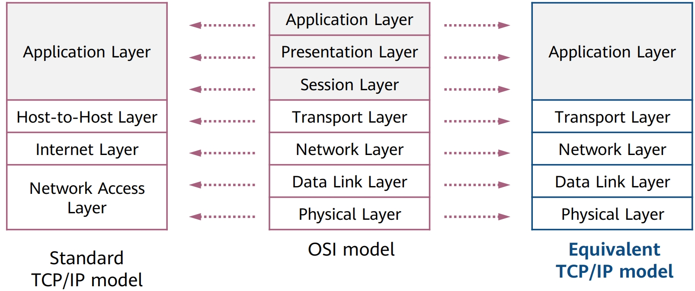
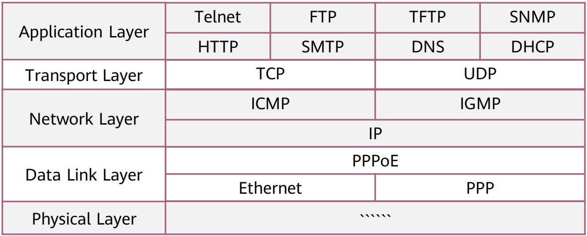
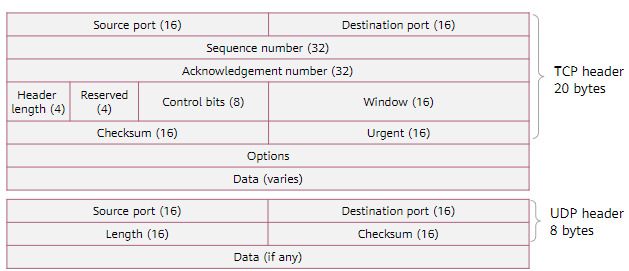
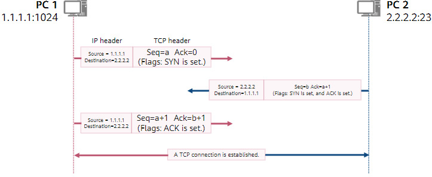

# Network reference model

## Network reference model and standard protocols

### OSI reference model

| layer |     name     |                                                                  description                                                                  |
|:-----:|:------------:|:---------------------------------------------------------------------------------------------------------------------------------------------:|
|   7   | Application  |                                                     Provides interfaces for applications.                                                     |
|   6   | Presentation | Translates data formats to ensure that the application-layer data of one system can be identified by the application layer of another system. |
|   5   |   Session    |                                 Establishes, manages, and terminates sessions between communicating parties.                                  |
|   4   |  Transport   |     Establishes, maintains and cancels an end-to-end data transmission process; controls transmission speeds and adjusts data sequences.      |
|   3   |   Network    |                                  Defines logical addresses and transfers data from sources to destinations.                                   |
|   2   |  Data Link   |                    Encapsulates packets into frames, transmits frames in P2P or P2MP mode, and implements error checking.                     |
|   1   |   Physical   |                       Transmits bitstreams over transmission media and defines electrical and physical specifications.                        |

### TCP/IP reference model

The OSI protocol stack is complex, and the TCP and IP protocols are widely used in the industry. Therefore, the TCP/IP reference model has become the mainstream reference model of the Internet.

### Common TCP/IP protocols

### Common protocol standardization organizations

- IET (Internet Engineering Task Force).

- IEEE (Institute of Electrical and Electronic Engineers).

- ISO (International Organization for Standardization).

### Application layer

It provides interfaces for application software so that applications can use network services. The application layer protocol designates transport layer protocol and ports.

> PDUs (Procces Data Unit) transmitted at the network layer are called **data**.

- HTTP $80$ (TCP): HyperText Transfer Protocol, which provides web browsing services.

- Telnet $23$ (TCP): remote login protocol, which provides remote management services.

- FTP $20$ and $21$ (TCP): File Transfer Protocol, which provides internet file resource sharing services.

- SMTP $25$ (TCP): Simple Mail Transfer Protocol, which provides Internet email services.

- TFTP $69$ (UDP): Simple File Transfer Protocol, which provides simple file transfer services.

### Transport layer

It receives data from an application layer protocol, encapsulates the data with the corresponding transport layer protocol header, and helps establish an end-to-end (port-to-port) connection

> PDUs transmitted at the transport layer are called **segments**.

- TCP: a connection-oriented reliable protocol defined by the IETF in RFC $793$.

- UDP: a simple connectionless protocol defined by the IETF in RFC $768$.

### TCP and UDP header formats

#### TCP header

- Source port: identifies the application that sends the segment.

- Destination port: identifies the application that receives the segment.

- Sequence number: every byte of data sent over a TCP connection has a sequence number. The value of the Sequence Number field equals the sequence number of the first byte in a sent segment.

- Acknowledgment number: indicates the sequence number of the next segment's first byte that the receiver is expecting to receive. The value of this field is $1$ plus the sequence number of the last byte in the previous segment that is successfully received. This field is valid only when the ACK flag is set.

- Header length: indicates the length of the TCP header. The unit is $32$ bits ($4$ bytes). If there is no option content, the value of this field is $5$, indicating that the header contains $20$ bytes.

- Reserved: this field is reserved and must be set to $0$.

- Control bits: it includes FIN, ACK, and SYN flags, indicating TCP data segments in different states.

- Window: used for TCP flow control. The value is the maximum number of bytes that are allowed by the receiver. The maximum window size is $65535$ bytes.

- Checksum: a mandatory field. It is calculated, stored by the sender, and verified by the receiver. During checksum computation, the TCP header and TCP data are included, and a $12$-byte pseudo header is added before the TCP segment.

- Urgent: indicates the urgent pointer. The urgent pointer is valid only when the URG flag is set. The Urgent field indicates that the sender transmits data in emergency mode. The urgent pointer indicates the number of urgent data bytes in a segment (urgent data is placed at the beginning of the segment).

- Options: This field is optional.

#### UDP header

- Source port: identifies the application that sends the segment.

- Destination port: identifies the application that receives the segment.

- Length: specifies the total length of the UDP header and data. The possible minimum length is $8$ bytes because the UDP header already occupies $8$ bytes. Due to the existence of this field, the total length of a UDP segment does not exceed $65535$ bytes (including an $8$-byte header and $65527$-byte data).

- Checksum: checksum of the UDP header and UDP data.

### TCP connection setup (three-way handshake)

Before sending data, a TCP-based application needs to establish a connection through three-way handshake.

The TCP connection setup process is as follows:

1. The TCP connection initiator ($\text{PC}_1$ in the figure) sends the first TCP segment with SYN being set. The initial sequence number $a$ is a randomly generated number. The acknowledgment number is $0$ because no segment has ever been received from $\text{PC}_2$.

2. After receiving a valid TCP segment with the SYN flag set, the receiver ($\text{PC}_2$) replies with a TCP segment with SYN and ACK set. The initial sequence number $b$ is a randomly generated number. Because the segment is a response to $\text{PC}_1$, the acknowledgment number is $a + 1$.

3. After receiving the TCP segment in which SYN and ACK are set, $\text{PC}_1$ replies with a segment in which ACK is set, the sequence number is $a + 1$, and the acknowledgment number is $b + 1$. After $\text{PC}_2$ receives the segment, a TCP connection is established.
