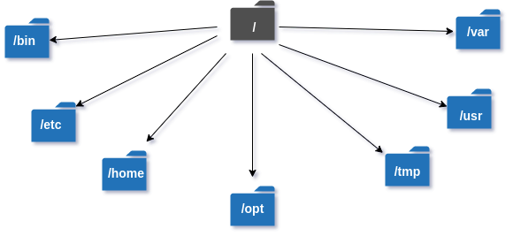

# Temario

## 01 - Comandos básicos de Linux

- `id [OPTION]... [USER]...`: print user and group information for each specified USER, or (when USER omitted) for the current process.

- `grep [OPTION...] PATTERNS [FILE...]`: grep searches for `PATTERNS` in each FILE. `PATTERNS` is one or more patterns separated by newline characters, and grep prints each line that matches a pattern.

- `/etc/groups`: defines the groups in the system. There is one entry per line, with the following format:

    ```BASH
    group_name:password:GID:user_list
    ```

    The fields are as follows:

    - `group_name`: the name of the group.

    - `password`: the (encrypted) group password. If this field is empty, no password is needed.

    - `GID`: the numeric group ID.

    - `user_list`: a list of the usernames that are members of this group, separated by commas.

    > These days, many people run some version of the shadow password suite, where `/etc/passwd` has an `x` in the password field, and the encrypted passwords are in `/etc/shadow`, which is readable by the superuser only.

## 02 - Comandos básicos de Linux

- `/etc/passwd`: describes user login accounts for the system. Each line of the file describes a single user, and contains seven colon-separated fields:

    ```BASH
    name:password:UID:GID:GECOS:directory:shell
    ```

    The fields are as follows:

    - `name`: the user's login name. It should not contain capital letters.

    - `GID`: the numeric primary group ID for this user.

        > Additional groups for the user are defined in the system group file (`/etc/groups`).

    - `GECOS` (General Electric Comprehensive Operating System): is optional and used only for informational purposes.

        > Usually, it contains the full username.

    - `directory`: the user's home directory (the initial directory where the user is placed after logging in).

        > this field is used to set the `HOME`.

    - `shell`: program to run at login (if empty, use `/bin/sh`).

        > If set to a nonexistent executable, the user will be unable to login through login.

        > The value in this field is used to set the `SHELL` environment variable.

- `/etc/shells`: is a text file that contains the full pathnames of valid login shells.

## 03 - Control del flujo stderr-stdout, operadores y procesos en segundo plano

- `/etc/hots`: is a simple text file that associates IP addresses with hostnames, one line per IP address. For each host, a single line should be present with the following information:

    ```BASH
    IP_address canonical_hostname [aliases...]
    ```

- `command; ...; command`: is used to separate multiple commands on the same line.

- `command && ... && command`: execute the command that follows it only if the previous command completes successfully.

- `command || ... || command`: execute the command that follows it only if the previous command fails.

- `/dev/null`: data written to this file is discarded.

    > It is used as a **data sink**.

### Environment variables

Often referred to as ENVs, are dynamic values that wield significant influence over the behavior of programs and processes in the Linux operating system.

- `$?`: is used to store the exit status of the last command executed in a shell script or a terminal. The exit status is a number between $0$ and $255$ that indicates whether the command was completed successfully or failed.

    > A value of 0 means success, while any other value means failure.

### Bash Redirections

Are a way of manipulating the input and output of commands in a shell script or a terminal. By default, a command takes input from the keyboard and outputs it to the screen, but redirections allow you to change the source and destination of the data.

- `cmd > file`: redirects the standard output (stdout) of `cmd` to `file`.

- `cmd &> file`: redirects stdout and stderr of `cmd` to `file`.

- `cmd > file 2>&1`: another way to redirect both stdout and stderr of `cmd` to `file`.

    > `> file` redirects stdout to `file`, and `2>&1` redirects stderr to the same place where stdout is going, which is `file` in this case.

- `cmd &`: run a command in the background.

- `disown`: is used to remove jobs from the job table or keep them running even after you close the terminal window.

## 04 - Descriptores de archivo

Are used to represent open files, sockets, pipes, and other input and output streams. A file descriptor is a non-negative integer value that serves as a unique identifier for a file or input/output channel that a process has opened.

- `exec [command [argument...]]`: shall open, close, and/or copy file descriptors as specified by any redirections as part of the command.

    > If `exec` is specified with command, it shall replace the shell with command without creating a new process. If arguments are specified, they shall be arguments to the command.

    Examples:

    - `exec 3<> file`: open `file` as file descriptor `3` for reading and writing.

        > To write to this file, we can use `... >&3`.

    - `exec 4[<>]&3`: make file descriptor `4` a copy of file descriptor `3`.

    - `exec 3[<>]&-`: close file descriptor `3`.

    - `exec 4[<>]&3-`: make file descriptor `4` a copy of file descriptor `3` and close file descriptor `3`.

## 05 - Lectura e interpretación de permisos

By executing `ls -l`, we can list the files using a long list format, which will show us the security of the files or directories. An example of this is:

```BASH
drwxr-xr-x 2 Brandon Brandon 4096 Jan 27 15:01 temp
```

Separating it into columns:

1. First.

    1. First character.

        - `-`: means it is a file.

        - `d`: means it is a directory.

    2. The next nine characters.

        - (`xxxxxxxxx`): show the security.

2. Second: number of hard links to the file or directory.

3. Third: owner of the file.

4. Fourth: group owner of the file.

5. Fifth: size of the file in bytes.

6. Sixth: the date and time the file was last modified.

7. Seventh: name of the file or the directory.

### What are the three permission groups in Linux?

```
---     ---     ---
rwx     rwx     rwx
user    group   other
```

### What are the three kinds of file permissions in Linux?

- `r` (read).

- `w` (write).

- `x` (execute).

    > In directories, it allows the user to enter the directory, and access files and directories inside.

### Operators and options

- `+`: add permissions.

- `-`: remove permissions.

- `=` set the permissions to the specified values.

---

- `u` (user): applies only to the owner of the file or directory.

- `g` (group): applies only to the group that has been assigned to the file or directory.

- `o` (other): applies to all other users on the system.

- `a` (all): all three (owner, groups, others).

## 07 - Asignación de permisos

To change the security permissions on files, we use `chmod`, which stands for "change mode", because the nine security characters are collectively called the security mode of the file.

- `chmod [OPTION]...`: change file mode bits.

    - `MODE[,MODE]... FILE...`.

    - `OCTAL-MODE FILE...`.

    - `--reference=RFILE FILE...`.

- `chgrp [OPTION]...`: change group ownership.

    - `GROUP FILE...`.

    - `--reference=RFILE FILE...`.

- `chown [OPTION]...`: change file owner and group.

    - `[OWNER][:[GROUP]] FILE...`.

    - `--reference=RFILE FILE...`.

- `useradd`: create a new user or update the default new user information.

    - `[options] LOGIN`.

    - `-D`.

    - `-D [options]`

- `groupadd [OPTIONS] NEWGROUP`: create a new group.

- `usermod [options] LOGIN`: modify a user account.

---

- `chmod ug+rw,o-x file.txt`: adds read (`r`) and write (`w`) permission to both user (`u`) and group (`g`) and revokes execute (`x`) permission from others (`o`) for the file `file.txt`.

- `chgrp new_group file.txt`: change the `file.txt` group to the `new_group` group.

- `useradd -m test`: create a user called "test" (with his respectively group) and create his home directory.

## 9 - Notación octal de permisos

| octal | binary | file mode |
|:-----:|:------:|:---------:|
|   0   |  000   |   `---`   |
|   1   |  001   |   `--x`   |
|   2   |  010   |   `-w-`   |
|   3   |  011   |   `-wx`   |
|   4   |  100   |   `r--`   |
|   5   |  101   |   `r-x`   |
|   6   |  110   |   `rw-`   |
|   7   |  111   |   `rwx`   |

Using the octal notations table instead of `r`, `w`, and `x`. Each digit octal notation can be used for either of the group `u`, `g`, or `o`. Executing `chmod ugo+rwx file.txt` is equal to `chmod 777 file.txt`.

## 10 - Permisos especiales – Sticky Bit, 11 - Control de atributos de ficheros en Linux – Chattr y Lsattr y 12 - Permisos especiales – SUID y SGID

### The setuid bit

This bit is present for files that have executable permissions. The setuid bit simply indicates that when running the executable, it will set its permissions to those of the user who created it (the owner), instead of setting them to the user who launched it. Similarly, there is a setgid bit that does the same for the gid.

To locate the setuid, look for an `s` instead of an `x` in the executable bit of the file permissions in the owner permission group.

- Set the setuid bit: `chmod u+s <file>` or `chmod 4--- <file>`.

- Remove the setuid bit: `chmod u-s <file>` or `chmod --- <file>`.

### The setgid bit

This bit affects both files and directories. When used on a file, it executes with the privileges of the group of the user who owns it, instead of executing with those of the group of the user who executed it. When the bit is set for a directory, the set of files in that directory will have the same group as the group of the parent directory, and not that of the user who created those files.

- Set the setgid bit: `chmod g+s <file>` or `chmod 2--- <file>`.

- Remove the setgid bit: `chmod g-s <file>` or `chmod --- <file>`.

### The sticky bit

When a directory has the sticky bit set, its files can be deleted or renamed only by the file owner, the directory owner and the root user.

- Set the sticky bit: `chmod +t <file>` or `chmod 1--- <file>`.

- Remove the sticky bit: `chmod -t <file>` or `chmod --- <file>`.

## 13 - Capabilities (privilegios especiales)

For the purpose of performing permission checks, traditional UNIX implementations distinguish two categories of processes: privileged processes (whose effective user ID is $0$, referred to as superuser or root), and unprivileged processes (whose effective UID is nonzero). Starting with Linux 2.2, Linux divides the privileges traditionally associated with the superuser into distinct units, known as **capabilities**, which can be independently enabled and disabled.

---

There are 5 options for a capability:

1. Permitted.

2. Inheritable.

3. Effective.

4. Bounding.

5. Ambient.

Only the first three can be assigned to executable files.

---

There are a lot of capabilities, but the most interesting two are:

- `CAP_SETUID`: make arbitrary manipulations of process UIDs.

- `CAP_SETGID`: make arbitrary manipulations of process GIDs.

---

- `getcap [-v] [-n] [-r] [-h] filename [...]`: displays the name and capabilities of each specified file.

- `setcap [-q] [-n <rootuid>] [-v] {capabilities|-|-r} filename [... capabilitiesN fileN]`: in the absence of the `-v` (verify) option, setcap sets the capabilities of each specified filename to the capabilities specified.

Examples of usage:

- `getcap -r / 2> /dev/null`: search for files that have capabilities in the entire system.

- `setcap -r file`: remove all the capabilities assigned to `file`.

- `setcap "all+pe cap_chown-pe" file`: add all capabilities in the Permitted and Effective sets of an executable, except for the `CAP_CHOWN` capability.

## 14 - Estructura de directorios del sistema

In Linux/Unix operating system, everything is a file; even directories are files, files are files, and devices like mouse, keyboard, printer, etc. are also files.

### Types of files in the Linux system

- General files.

- Directory files.

- Devices files.



The Linux/Unix file system hierarchy base begins at the root, and everything starts with the root directory.

|   directory   |                                                          description                                                          |
|:-------------:|:-----------------------------------------------------------------------------------------------------------------------------:|
|    `/bin`     |                                                Binary or executable programs.                                                 |
|    `/etc`     |                                                  System configuration files.                                                  |
|    `/home`    |                                     Home directory. It is the default current directory.                                      |
|    `/opt`     |                                               Optional or third-party software.                                               |
|    `/tmp`     |                                         Temporary space, typically cleared on reboot.                                         |
|    `/usr`     |                                                    User-related programs.                                                     |
|    `/var`     |                                                          Log files.                                                           |
|    `/boot`    |                     Contains all the boot-related information files and folders such as conf, grub, etc.                      |
|    `/dev`     |                                   Location of device files such as dev/sda1, dev/sda2, etc.                                   |
|    `/lib`     |                                         Contains kernel modules and a shared library.                                         |
| `/lost+found` |                                        Used to find recovered bits of corrupted files.                                        |
|   `/media`    |                              Contains subdirectories where removable media devices are inserted.                              |
|    `/mnt`     |                              Contains temporary mount directories for mounting the file system.                               |
|    `/proc`    |       A virtual and pseudo-file system containing information about running processes with specific process IDs (PIDs).       |
|    `/run`     |                                                 Stores volatile runtime data.                                                 |
|    `/sbin`    |                                       Binary executable programs for an administrator.                                        |
|    `/srv`     |                                      Contains server-specific and server-related files.                                       |
|    `/sys`     | A virtual file system for modern Linux distributions to store and allows modification of the devices connected to the system. |

## 18 - Búsquedas a nivel de sistema

- `find [-H] [-L] [-P] [-D debugopts] [-Olevel] [starting-point...] [expression]`: search for files in a directory hierarchy.

    Some interesting options are:

    - `-type c`: File is of type "c".

        - `f`: regular file.

        - `d`: directory.

    - `-name pattern`: base of file name (the path with the leading directories removed) matches shell pattern "pattern".

        > `-iname pattern` like `-name`, but the match is case insensitive.

    - `-perm mode`: file's permission bits are exactly "mode".

    - `-group gname`: File belongs to group "gname".

        > numeric group ID allowed.

    - `-user uname`: file is owned by user "uname".

        > numeric user ID allowed.

    - `-ls`: list current file in `ls -dils` format on standard output.

    - `! expr`: True if "expr" is false.

        > This character will also usually need protection from interpretation by the shell.

        > `-not expr` same as `! expr`, but not POSIX compliant.

- `xargs [options] [command [initial-arguments]]`: build and execute command lines from standard input.

    Because Unix filenames can contain blanks and newlines, this default behavior is often problematic; filenames containing blanks and/or newlines are incorrectly processed by xargs. In these situations, it is better to use the `-0` option, which prevents such problems. When using this option, you will need to ensure that the program which produces the input for xargs also uses a null character as a separator.

    > If that program is GNU find for example, the `-print0` option does this for you.

Examples of usage:

- `find / -name passwd 2>/dev/null | xargs -ls`: build and execute command lines from standard input.

## 19 - Conexiones SSH

SSH (Secure Shell) is an access credential that is used in the SSH Protocol. In other words, it is a cryptographic network protocol that is used for transferring encrypted data over a network.

It always comes in a key pair:

1. Public key: everyone can see it; there is no need to protect it.

    > For encryption function.

2. Private key: stays on the computer; must be protected.

    > For decryption function.

### How does SSH work?

It uses asymmetric ciphers for encryption and decryption. The General procedure is:

1. Public keys from the local computers (system) are passed to the server, which is to be accessed.

2. The server then determines if the public key is registered.

3. If so, the server then creates a new secret key and encrypts it with the public key that was sent to it via a local computer.

4. This encrypted code is sent to the local computer.

5. This data is unlocked by the private key of the system and sent to the server.

6. The server, after receiving this data, verifies the local computer.

7. SSH creates a route, and all the encrypted data is transferred through it with no security issues.

SSH is key based authentication that is not prone to **brute-force attacks**.

### Bandit level 0

1. `ssh bandit0@bandit.labs.overthewire.org -p 2220`: connect to the machine as the "bandit0".

    > The password for that user is `bandit0`.

### Bandit level 1

1. `cat readme`: show the `readme` content.

    > The password for `bandit1` is `NH2SXQwcBdpmTEzi3bvBHMM9H66vVXjL`.

## 20 - Lectura de archivos especiales

### Bandit level 2

1. `cat < -`: displays the content of `-`.

    > The password for `bandit2` is `rRGizSaX8Mk1RTb1CNQoXTcYZWU6lgzi`.

## 21 - Lectura de archivos especiales

### Bandit level 3

1. `cat "spaces in the filename"`: displays the content of `spaces in the filename`.

    > The password for `bandit3` is `aBZ0W5EmUfAf7kHTQeOwd8bauFJ2lAiG`.

## 22 - Directorios y archivos ocultos

### Bandit level 4

1. `cat inhere/.hidden`: displays the content of `.hidden`.

    > The password for `bandit4` is `2EW7BBsr6aMMoJ2HjW067dm8EgX26xNe`.

## 23 - Detección del tipo y formato de archivos

### Bandit level 5

1. `find inhere/ -type f | xargs file`: see what file is human readable.

    > That file is `-file07`.

2. `cat inhere/-file07`: displays the content of `-file07`.

    > The password for `bandit5` is `lrIWWI6bB37kxfiCQZqUdOIYfr6eEeqR`.

## 24 - Búsquedas precisas de archivos

### Bandit level 6

1. `find inhere/ -type f -size 1033c -not -executable| xargs file`: find files that are $1033$ bytes in size and are not executable, to see which of those is human readable.

    > That file is `.file02`.

2. `cat inhere/maybehere07/.file2`: displays the content of `-file07`.

    > The password for `bandit6` is `P4L4vucdmLnm8I7Vl7jG1ApGSfjYKqJU`.

## 25 - Búsquedas precisas de archivos

### Bandit level 7

1. `find / -type f -size 33c -user bandit7 -group bandit6 2> /dev/null | xargs file`: find files that have $33$ bytes, belonging to user "bandit7" and group "bandit6", to see which of them is human readable.

    > That file is `bandit7.password`.

2. `cat /var/lib/dpkg/info/bandit7.password`: show the `bandit7.password` content.

    > The password for `bandit7` is `z7WtoNQU2XfjmMtWA8u5rN4vzqu4v99S`.

## 26 - Métodos de filtrado de datos

### Bandit level 8

1. `cat data.txt | grep millionth`: displays the content of `data.txt` and filter only the lines that contain the word "millionth".

    > The password for `bandit8` is `TESKZC0XvTetK0S9xNwm25STk5iWrBvP`.

## 27 - Métodos de filtrado de datos

- `sort`: write sorted concatenation of all FILE(s) to standard output.

    > With no FILE, or when FILE is `-`, read standard input.

    - `[OPTION]... [FILE]...`.

    - `[OPTION]... --files0-from=F`

- `uniq [OPTION]... [INPUT [OUTPUT]]`: filter adjacent matching lines from INPUT (or standard input), writing to OUTPUT (or standard output).

    > With no options, matching lines are merged into the first occurrence.

    - `-u` or `--unique`: only print unique lines.

## 28 - Métodos de filtrado de datos

### Bandit level 9

1. `sort data.txt | uniq -u`: sort the lines in data.txt and then filter out only the unique line.

    > The password for `bandit9` is `EN632PlfYiZbn3PhVK3XOGSlNInNE00t`.

## 29 - Interpretación de archivos binarios

- `string`: print the sequences of printable characters in files.

    - `[-afovV] [-min-len]`.

    - `[-n min-len] [--bytes=min-len]`.

    - `[-t radix] [--radix=radix]`.

    - `[-e encoding] [--encoding=encoding]`.

    - `[-U method] [--unicode=method]`.

    - `[-] [--all] [--print-file-name]`.

    - `[-T bfdname] [--target=bfdname]`.

    - `[-w] [--include-all-whitespace]`.

    - `[-s] [--output-separator sep_string]`.

    - `[--help] [--version] file...`.

### Bandit level 10

1. `strings data.txt | grep -E "=+"`: find human readable strings in data.txt that are preceded by several (more than one) `=`.

    > The password for `bandit10` is `G7w8LIi6J3kTb8A7j9LgrywtEUlyyp6s`.

## 30 - Codificación y decodificación en base64

- `base64 [OPTION]... [FILE]`: encode or decode FILE, or standard input, to standard output.

### Base 64

It is an encoding scheme that converts binary data into text format so that encoded textual data can be easily transported over a network uncorrupted and without any data loss.

### Bandit level 11

1. `base64 -d < data.txt`: decodes the base64-encoded data in `data.txt` and displays the password for "bandit11".

    > The password for `bandit11` is `6zPeziLdR2RKNdNYFNb6nVCKzphlXHBM`.

## 31 - Cifrado césar y uso de `tr` para la traducción de caracteres


### Bandit level 12

The entire alphabet is `abcdefghijklmnopqrstuvwxyz` translates into `nopqrstuvwxyzabcdefghijklm`.

1. `tr [A-Za-z] [N-ZA-Mn-za-m] < data.txt`: translates (substitutes) each letter in the range A-Z and a-z according to the ROT13 cipher.

    > The password for `bandit12` is `JVNBBFSmZwKKOP0XbFXOoW8chDz5yVRv`.

## 32 - Creamos un descompresor recursivo automático de archivos en Bash

- `tee [OPTION]... [FILE]...`: read from standard input and write to standard output and files.

- `sponge [OPTION] [FILE]`: soak up standard input and write to a file.

    > It avoids issues that might occur when writing to a file that is also being read at the same time (e.g., when using `>` directly).

- `xxd`: creates a hex dump of a given file or standard input. It can also convert a hex dump back to its original binary form.

    - `-h[elp]`.

    - `-r[evert] [options] [infile [outfile]]`.

    - `[options] [infile [outfile]]`.

### Bandit level 13

1. `xxd -r < bandit12.txt | sponge bandit12.txt`: reverse the hexdump in `bandit12.txt` to restore the original binary data.

To automate the decompression of files, we will create a script.

```BASH
#!/bin/bash

function ctrl_c() {
    echo -e "\n Exiting...\n"
    exit 1
}

trap ctrl_c INT

file=$1

while [ $file ]; do
    7z x $file &>/dev/null
    echo -e "Decompressed file: $file\n"
    file="$(7z l $file 2>/dev/null | tail -n 3 | head -n 1 | awk 'NF{print $NF}')"
done

cat data9.bin

rm *.bin
rm {data2,data6}
```

> The password for `bandit13` is `wbWdlBxEir4CaE8LaPhauuOo6pwRmrDw`.

## 33 - Manejo de pares de claves y conexiones SSH

After creating an ssh key with the command `ssh-keygen`.

2 ways to secure ssh access:

> `systemctl start sshd` to start the ssh daemon.

1. Save the public key in the authorized keys file (`authorized_keys`) and share the private key.

2. Share only the private key after running `ssh-copy-id -i <private key> <user>@<hostname>`.

### Bandit level 14

1. `ssh -i sshkey.private bandit14@localhost -p 2220`: uses the private SSH key (`sshkey.private`) to connect to the "bandit14" user on the localhost (the machine you are currently working on) via SSH on port $2220$.

2. `cat /etc/bandit_pass/bandit14`.

    > The password for `bandit14` is `fGrHPx402xGC7U7rXKDaxiWFTOiF0ENq`.

## 34 - Uso de netcat para realizar conexiones

- `nc [OPTION]...`: is used for just about anything under the sun involving TCP, UDP, or UNIX-domain sockets. It can open TCP connections, send UDP packets, listen on arbitrary TCP and UDP ports, do port scanning, and deal with both IPv4 and IPv6.

    - `[destination] [port]`.

- `ss [options] [ FILTER ]`: utility to investigate sockets.

    - `-n` or `--numeric`: do not try to resolve service names.

    - `-l` or `--listening`: display only listening sockets.

    - `-p` or `--processes`: show process using socket.

    - `-t` or `--tcp`: display TCP sockets.

- `/proc/net/tcp`: holds a dump of the TCP socket table.

- `lsof [OPTION]...`: list open files.

    - `-i [i]`: selects the listing of files any of whose Internet address matches the address specified in `i`.

- `ps [OPTION]...`: displays information about a selection of the active processes.

    - `-f`: do full-format listing.

    - `-a`: select all processes, except both session leaders and processes not associated with a terminal.

    - `-u userlist`: select by effective user ID (EUID) or name.

### Bandit level 15

1. `nc localhost 30000`: connect to the localhost on port $30000$.

    > The password for `bandit15` is `jN2kgmIXJ6fShzhT2avhotn4Zcka6tnt`.

## 35 - Uso de conexiones encriptadas

### OpenSSL

is a cryptography toolkit implementing the Secure Sockets Layer (SSL) and Transport Layer Security (TLS) network protocols and related cryptography standards required by them.

- `openssl command [OPTION]...`: OpenSSL command line program.

    - `s_client`: this implements a generic SSL/TLS client which can establish a transparent connection to a remote server speaking SSL/TLS.

### Bandit level 16

1. `openssl s_client -connect localhost:30001`: connect to the localhost on port $30001$ using the Secure Socket Layer (SSL) protocol.

    > The password for `bandit16` is `JQttfApK4SeyHwDlI9SXGR50qclOAil1`.

## 36 - Creando nuestros propios escáneres en Bash

- `mktemp`: make a unique temporary filename.

### Bandit level 17

1. `mktemp`: create a temporary file to write a script in it.

2. Write a scan scrip in the temporary file.

    ```BASH
    #!/bin/bash

    for port in $(seq 31000 32000); do
        (echo "" > /dev/tcp/127.0.0.1/$port) 2>/dev/null && echo "[+] $port" &
    done;
    ```

3. `<temporary file>`: execute the script.

4. `openssl s_client -connect localhost:31790`: returns a private RSA key if the `bandit16` password is provided.

5. In the previous temporary file, paste the private RSA key content.

6. `ssh -i <temporary file> bandit16@localhost -p 2220`: uses the private RSA key to establish an SSH connection to the `bandit16` on the localhost via SSH on port $2220$.

7. `cat /etc/bandit_pass/bandit17`: displays the password for `bandit17`.

    > The password for `bandit17` is `VwOSWtCA7lRKkTfbr2IDh6awj9RNZM5e`.

## 37 - Detección de diferencias entre archivos

- `diff [OPTION]... FILES`: compare files line by line.

### Bandit level 18

1. `diff passwords.old passwords.new`: compares the contents of the two files and highlights the differences.

    > The password for `bandit18` is `hga5tuuCLF6fFzUpnagiMN8ssu9LFrdg`.

## 38 - Ejecución de comandos por SSH

### Bandit level 19

1. `ssh bandit18@bandit.labs.overthewire.org -p 2220 "cat readme"`: connects to the `bandit18` on the specified server, and remotely executes the command `cat readme` to display the content of the readme file.

    > The password for `bandit19` is `awhqfNnAbc1naukrpqDYcF95h7HoMTrC`.

## 39 - Abusando de privilegio SUID para migrar de usuario

### Bandit level 20

1. `./bandit20-do cat /etc/bandit_pass/bandit20`: executes the setuid `bandit20-do` with the `cat /etc/bandit_pass/bandit20`. The setuid binary runs with the permissions of the owner (in this case, bandit20), allowing you to read the password file.

    > The password for `bandit20` is `VxCazJaVykI6W36BkBU0mJTCM8rR95XT`.

## 40 - Jugando con conexiones

### Bandit level 21

Having two terminals, in the first one we will have `nc` listening to port $4646$ (the port does not matter as long as it is available), and in the other one we will connect to that port using the `suconnect` binary provided.

1. First PC.

    - `nc -lv localhost 4646`: starts to listenening on port $4646$, waiting for incoming connections.

2. Second PC.

    - `./suconnect 4646`: executes the provided `suconnect` binary to connect to the listening port $4646$. This creates a secure connection for transferring the password.

3. Fist PC.

    - `VxCazJaVykI6W36BkBU0mJTCM8rR95XT`: the password entered on the first terminal (first PC), which gets transferred securely to the second terminal.

> The password for `bandit21` is `NvEJF7oVjkddltPSrdKEFOllh9V1IBcq`.

## 41 - Abusando de tareas Cron

### Cron

It is a widely used software utility available on Unix-like operating systems that is used for the purpose of job scheduling. Certain programs or scripts that might be required to be run occasionally are added as a Cron job and a schedule is defined to describe when to run this job.

#### Expressions (Cron)

Provide one way of specifying a schedule.

```
<seconds> <minutes> <hours> <day-of-month> <month> <day-of-week> <year>
```

Based on the values specified for each of the components above, complex schedules may be created. Special characters used in Cron Expressions:

| character |                                                                                                             meaning                                                                                                              |
|:---------:|:--------------------------------------------------------------------------------------------------------------------------------------------------------------------------------------------------------------------------------:|
|    `*`    |                                            All. Represents that the schedule should run for every time unit. A `*` in the minute field indicates that the schedule runs every minute.                                            |
|    `?`    | Any. Represents any arbitrary value. This can be used only in `day-of-month` and `day-of-week` fields. A `?` in `day-of-month` field will not use the `day-of-month` for deciding the schedule, as any value is acceptable here. |
|    `-`    |                                                                                         Range. Represents a continuous range of values.                                                                                          |
|    `,`    |                                                                                      Multiple Values. Separates a list of different values.                                                                                      |
|    `/`    |                                                                           Increment. Specifies the amount by which to increment the values of a field.                                                                           |

> The `day-of-month` and `day-of-week` fields cannot be specified with the same value simultaneously in the same cron expression. If one of the two values is represented by a `*` the other must be represented by `?`.

- `cron`: daemon to execute scheduled commands.

    - `[-c | -h | -i | -n | -p | -P | -s | -m<mailcommand>]`.

    - `-x [ext,sch,proc,pars,load,misc,test,bit]`.

    - `-V`.

### Bandit level 22

1. `cat cronjob_bandit22`: displays the content of the cron job configuration file (`cronjob_bandit22`).

2. `cat /usr/bin/cronjob_bandit22.sh`: displays the content of the shell script (`cronjob_bandit22.sh`) referenced in the cron job configuration.

3. `cat /tmp/t7O6lds9S0RqQh9aMcz6ShpAoZKF7fgv`: displays the contents of the file storing the password `bandit22`.

    > The password for `bandit22` is `WdDozAdTM2z9DiFEQ2mGlwngMfj4EZff`.

## 42 - Abusando de tareas Cron

- `md5sum [OPTION]... [FILE]...`: compute and check the MD5 message digest.

    - `-t`: Read in text mode.

        > Default.

    > With no `FILE`, or when `FILE` is `-`, read standard input.

### Bandit level 23

1. `cat cronjob_bandit23`: displays the content of the cron job configuration file (`cronjob_bandit23`).

2. `cat /usr/bin/cronjob_bandit23.sh`: displays the content of the shell script (`cronjob_bandit23.sh`) referenced in the cron job configuration.

3. `cat /temp/$(echo I am user bandit23 | md5sum | cut -d ' ' -f 1)`: displays the content of the file described in the `/usr/bin/cronjob_bandit23.sh` script.

> The password for `bandit23` is `QYw0Y2aiA672PsMmh9puTQuhoz8SyR2G`.

## 43 - Abusando de tareas Cron

- `watch [options] command`: execute a program periodically, showing output full screen.

### Bandit level 24

1. `cat cronjob_bandit24`: displays the content of the cron job configuration file (`cronjob_bandit24`).

2. `cat /usr/bin/cronjob_bandit24.sh`: displays the content of the shell script (`cronjob_bandit24.sh`) referenced in the cron job configuration.

    ```BASH
    #!/bin/bash

    # Get the current username
    myname=$(whoami)

    # Change to the directory where scripts are stored
    cd /var/spool/$myname/foo

    # Print a message about executing and deleting scripts
    echo "Executing and deleting all scripts in /var/spool/$myname/foo:"

    # Iterate over all files (including hidden files) in the directory
    for i in * .*;
    do
        # Skip the current directory (.) and parent directory (..)
        if [ "$i" != "." -a "$i" != ".." ];
        then
            # Print a message about handling the current file
            echo "Handling $i"

            # Get the owner of the current file
            owner="$(stat --format "%U" ./$i)"

            # If the owner is "bandit23", execute the script with a timeout of 60 seconds
            if [ "${owner}" = "bandit23" ]; then
                timeout -s 9 60 ./$i
            fi

            # Remove the current file
            rm -f ./$i
        fi
    done
    ```

3. `chmod o+w $(mktemp -d)`: creates a temporary directory and grants write permissions to others on it.

4. `touch <temp dir>/script && chmod u+x <temp dir>/script`: creates an executable script in the temporary directory.

5. Obtain the password through the execution of the `script` as `bandit24`.

    ```BASH
    #!/bin/bash

    cp /etc/bandit_pass/bandit24 /tmp/tmp.3qnXYcGAz3
    chmod o+r /tmp/tmp.3qnXYcGAz3/bandit24
    ```

6. `cp <temp dir>/script /var/spool/bandit24/foo`: copies the script to the directory where the cron job executes.

7. `cat <temp dir>/bandit24`: displays the content of the temporary file containing the password for `bandit24`.

    > The password for `bandit24` is `VAfGXJ1PBSsPSnvsjI8p759leLZ9GGar`.

## 44 - Fuerza bruta aplicada a conexiones

### Bandit level 25

1. `cd $(mktemp -d) && touch script && chmod u+x script`: creates a temporary directory and moves to it to create an executable script in the temporary directory.

2. Brute force approach.

    - Direct.

        ```BASH
        #!/bin/bash

        for pin in {0000..9999}; do
            timeout 0.75 bash -c "echo 'VAfGXJ1PBSsPSnvsjI8p759leLZ9GGar $pin' | nc localhost 30002"

            if [ $? -eq 0 ]; then
                echo "The pin is $pin"
                break
            fi
        done
        ```

        > This solution will take $10000 * 0,75 = 7500 \text{ s } = 125 \text{ m }$.

    - Indirect.

        ```BASH
        #!/bin/bash

        if [ -f combinations.txt ]; then
            echo "" > combinations.txt
        else
            touch combinations.txt
        fi

        start=9000

        for pin in $(seq $start 9999); do
            echo "VAfGXJ1PBSsPSnvsjI8p759leLZ9GGar $pin" >> combinations.txt
        done

        if [ -f result.txt ]; then
            echo "" > result.txt
        else
            touch result.txt
        fi

        cat combinations.txt | nc localhost 30002 >> result.txt

        grep -vE "Wrong!|I am the pincode checker for user bandit25" result.txt

        echo "The correct pin is $(( $(grep -c "Wrong!" result.txt) + $start ))"
        ```

        > The machine is too slow to run all possibilities.

    > The password for `bandit25` is `p7TaowMYrmu23Ol8hiZh9UvD0O9hpx8d`.

## 45 - Escapando del contexto de un comando

### Bandit level 26

1. `cat /usr/bin/showtext`: displays the content of `/usr/bin/showtext`.

    ```SH
    #!/bin/sh

    export TERM=linux

    exec more ~/text.txt
    exit 0
    ```

2. `ssh -i bandit26.sshkey bandit26@bandit.labs.overthewire.org -p 2220`: uses the `bandit26.sshkey` key to establish an SSH connection to the `bandit26` on the localhost via SSH on port $2220$.

3. Minimize the terminal sufficiently to trigger the More pager, which displays a banner.

4. `v`: open the editor in More Mode.

5. `set shell=/bin/bash`: setting the shell of the user to a Bash shell.

6. `shell`: execute the shell command to spawn a new Bash shell.

7. `cat /etc/bandit_pass/bandit26`: displays the password for `bandit26`.

    > The password for `bandit26` is `c7GvcKlw9mC7aUQaPx7nwFstuAIBw1o1`.

### Bandit level 27

1. `./bandit27-do cat /etc/bandit_pass/bandit27`: executes the setuid `bandit27-do` with the `cat /etc/bandit_pass/bandit27`. The setuid binary runs with the permissions of the owner (in this case, bandit27), allowing you to read the password file.

    > The password for `bandit27` is `YnQpBuifNMas1hcUFk70ZmqkhUU2EuaS`.

## 46 - Operando con proyectos de Github

### Bandit level 28

1. `cd $(mktemp -d)`: creates a temporary directory and moves to it.

2. `git clone ssh://bandit27-git@localhost:2220/home/bandit27-git/repo`: clones the Git repository using the provided URL and credentials.

3. `cat repo/README`: displays the content of `README`.

    > The password for `bandit28` is `AVanL161y9rsbcJIsFHuw35rjaOM19nR`.

## 47 - Operando con proyectos de Github

### Bandit level 29

1. `cd $(mktemp -d)`: creates a temporary directory and moves to it.

2. `git clone ssh://bandit28-git@localhost:2220/home/bandit28-git/repo`: clones the Git repository using the provided URL and credentials.

3. `git log --oneline`: displays a concise history of commits.

4. `git show <leak info commit id>`: displays the content of the changes made in the info leak commit.

    > The password for `bandit29` is `tQKvmcwNYcFS6vmPHIUSI3ShmsrQZK8S`.

## 48 - Operando con proyectos de Github

### Bandit level 30

1. `cd $(mktemp -d)`: creates a temporary directory and moves to it.

2. `git clone ssh://bandit29-git@localhost:2220/home/bandit29-git/repo`: clones the Git repository using the provided URL and credentials.

3. `git branch -a`: displays all branches in the repository.

4. `git checkout dev`: switches to the dev branch.

5. `cat READMED.md`: displays the content of `README.md`, which contains the password for the next level.

    > The password for `bandit30` is `xbhV3HpNGlTIdnjUrdAlPzc2L6y9EOnS`.

## 49 - Operando con proyectos de Github

### Bandit level 31

1. `cd $(mktemp -d)`: creates a temporary directory and moves to it.

2. `git clone ssh://bandit30-git@localhost:2220/home/bandit30-git/repo`: clones the Git repository using the provided URL and credentials.

3. `git tag`: displays all tags in the repository..

4. `git show <tag>`: displays the contents of the `<tag>` tag.

    > The password for `bandit31` is `OoffzGDlzhAlerFJ2cAiz1D41JW1Mhmt`.

## 50 - Operando con proyectos de Github

### Bandit level 32

1. `cd $(mktemp -d)`: creates a temporary directory and moves to it.

2. `git clone ssh://bandit31-git@localhost:2220/home/bandit31-git/repo`: clones the Git repository using the provided URL and credentials.

3. `cat README.md`: displays the content of `README.md`.

    ```
    This time your task is to push a file to the remote repository.

    Details:
        File name: key.txt
        Content: 'May I come in?'
        Branch: master
    ```

4. `touch key.txt && echo "May I come in?" > key.txt`: creates a new file `key.txt` with the specified content.

5. `git add -f key.txt && git commit -m "Add key.txt file"`: adds `key.txt` to the staging area and commits it with an appropriate message.

6. `git push origin`: pushes the committed changes to the remote repository.

    > The password for `bandit32` is `rmCBvG56y58BXzv98yZGdO7ATVL5dW8y`.

## 51 - Argumentos posicionales en Bash

### Bandit level 33

- `$0`: executes the shell that holds the execution of the uppershell (bash).

    > The final level.
