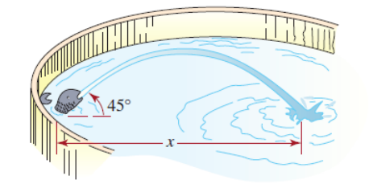
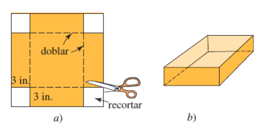

# First midterm

1. Hallar la ecuación canónica del círculo con ecuación general $x^2 + y^2 - 16 x + 3 y + 63 = 0$ y determinar centro y radio.

    1. $x^2 - 16 x$.

        $$
        a = x \quad 2 a b = -16 x \\[10 pt]

        2 x b = -16 x \quad b = -8
        $$

    2. $y^2 + 3 y$.

        $$
        a = y \quad 2 a b = 3 y \\[10 pt]

        2 y b = 3 y \quad b = \frac{ 3 }{ 2 }
        $$

    $$
    x^2 - 16 x + (-8)^2 +y^2 + 3y + \left ( \frac{ 3 }{ 2 } \right )^2 = -63 + 8^2 + \left ( \frac{ 3 }{ 2 } \right )^2 \\[10 pt]

    (x - 8)^2 + \left (y + \frac{ 3 }{ 2 } \right )^2 = \frac{ 14 }{ 4 } \quad (x - 8)^2 + \left (y + \frac{ 3 }{ 2 } \right )^2 = \frac{ 13 }{ 4 }
    $$

    $$
    c \left (8,-\frac{ 3 }{ 2 } \right ) \quad r = \frac{ \sqrt{ 13 } }{ 2 }
    $$

2. Hallar la ecuación de la recta que pasa por $A(4,-5)$ y es perpendicular a la recta $3 y = -\frac{ 2 } { 5 } x + 3$.

    $$
    y = -\frac{ 2 } { 15 } x + 1 \quad m_1 = -\frac{ 2 } { 15 } \\[10 pt]

    m_1 * m_2 = -1 \quad m_2 = \frac{ -1 }{ m_1 } = \frac{ -1 }{ -\frac{ 2 }{ 15 } } = \frac{ 15 } { 2 } \\[10 pt]

    m = \frac{ y_2 - y_1 }{ x_2 - x_1 } \quad (x_2 - x_1) m = y_2 - y_1 \quad (x - 4) \frac{ 15 }{ 2 } = -5 + y \\[10 pt]

    y = \frac{ 15 }{ 2 } x - 25
    $$

3. Cierta marca de tierra para macetas contiene $10\%$ de humus y otra marca contiene $30\%$. ¿Cuánto de cada tierra debe mezclarse para producir $2$ pies cúbicos de tierra para macetas compuesta por $25\%$ de humus?

    $$
    T = T_1 + T_2 = 2 \quad T_2 = 2 - T_1 \\[10 pt]

    0,1 T_1 + 0,3 (2 - T_1) = 0,25 T = 0,25 (2) \quad T_1 = \frac{ 0,1 }{ 0,2 } = 0,5 \; \text{ft}^3 \\[10 pt]

    T_2 = 2 - 0,5 = 1,5 \; \text{ft}^3
    $$

4. María tiene una hoja de cartulina con el largo igual al doble de su ancho. Si recorta un cuadrado de $3$ pulgadas de lado en cada esquina y dobla los lados hacia arriba para formar una caja sin tapa, tendrá una caja con un volumen de $140$ pulgadas cúbicas. Halle las dimensiones de la hoja de cartulina original.

    

    $$
    a_1 = 2 b_1 \quad a_2 b_2 h = 140 \\[10 pt]

    a_2 = a_1 - 6 \quad b_2 = b_1 - 6 \quad h = 3 \\[10 pt]

    a_2 = 2 b_1 - 6 \quad (2 b_1 - 6) (b_1 - 6) (3) = 140 \\[10 pt]

    2 {b_1}^2 - 12 b_1 - 6 b_1 + 36 - \frac{ 140 }{ 3 } = 0 \quad 2 {b_1}^2 - 18 b_1 - \frac{ 32 }{ 3 } = 0 \\[10 pt]

    b_1 = \frac{ 27 + \sqrt{ 921 } }{ 6 } \approx 9,56'' \quad b_1 = \frac{ 27 - \sqrt{ 921 } }{ 6 } \approx 0,56 \\[10 pt]

    a_1 = \frac{ 27 + \sqrt{ 921 } }{ 3 } \approx 19,12''
    $$

5. Si se lanza desde el suelo un objeto hacia arriba con un ángulo de $45 \degree$ y una velocidad inicial de $v_0$ metros por segundo, entonces la altura y en metros arriba del suelo a una distancia horizontal de $x$ metros desde el punto del lanzamiento está dada por la fórmula:

    $$
    y = x - \frac{ 9,8 }{ { v_0 }^2 } x^2
    $$

    

   - Si una fuente arroja agua con un ángulo de 45° y una velocidad de 7 $\frac{ m }{ s }$, ¿a qué distancia del chorro caerá el agua sobre la pileta?

        $$
        0 = x - \frac{ 9,8 }{ 7^2 } x^2 \quad x \left (1 - \frac{ 9,8 }{ 49 } x \right ) = 0 \\[10 pt]

        1 - \frac{ 9,8 }{ 49 } x = 0 \quad x = \frac{ 49 }{ 9,8 } = 5 \text{m}
        $$

6. Resolver las desigualdades.

    1. $\left | \frac{ 2 - 5 x}{ 3 } \right | \geq 5$.

        1. $2 - 5 x > 0$

            $$
            x < \frac{ 2 }{ 5 } \quad x \in \left (-\infty,\frac{ 2 }{ 5 } \right ) \\[10 pt]

            \frac{ 2 - 5 x}{ 3 } \geq 5 \quad x \leq -\frac{ 13 }{ 5 } \quad x \in \left (-\infty,-\frac{ 13 }{ 5 } \right ] \\[10 pt]

            x \in \left (-\infty,\frac{ 2 }{ 5 } \right ) \cap \left (-\infty,-\frac{ 13 }{ 5 } \right ] \quad x \in \left (-\infty,-\frac{ 13 }{ 5 } \right ]
            $$

        2. $2 - 5 x < 0$

            $$
            x > \frac{ 2 }{ 5 } \quad x \in \left (\frac{ 2 }{ 5 },\infty \right ) \\[10 pt]

            -\frac{ 2 - 5 x}{ 3 } \geq 5 \quad x \geq \frac{ 17 }{ 5 } \quad x \in \left [\frac{ 17 }{ 5 },\infty \right ) \\[10 pt]

            x \in \left (\frac{ 2 }{ 5 },\infty \right ) \cap \left [\frac{ 17 }{ 5 },\infty \right ) \quad x \in \left [\frac{ 17 }{ 5 },\infty \right )
            $$

    $$
    x \in \left (-\infty,-\frac{ 13 }{ 5 } \right ] \cup \left [\frac{ 17 }{ 5 },\infty \right )
    $$

    7. $| x - (-2) | < 0,001$.

        1. $x - (-2) > 0$.

            $$
            x > -2 \quad x \in (-2,\infty) \\[10 pt]

            x - (-2)  < 0,001 \quad x < -1,999 \quad x \in (-\infty,-1,999) \\[10 pt]

            x \in (-2,\infty) \cap (-\infty,-1,999) \quad x \in (-2,-1,999)
            $$

        2. $x - (-2) < 0$.

            $$
            x < -2 \quad x \in (-\infty,-2) \\[10 pt]

            -(x - (-2))  < 0,001 \quad x > -2,001 \quad x \in (-2,001,\infty) \\[10 pt]

            x \in (-\infty,-2) \cap (-2,001,\infty) \quad x \in (-2,001,-2)
            $$

        $$
        x \in (-2,-1,999) \cup (-2,001,-2) \quad x \in (-2,001,-1,999)
        $$
