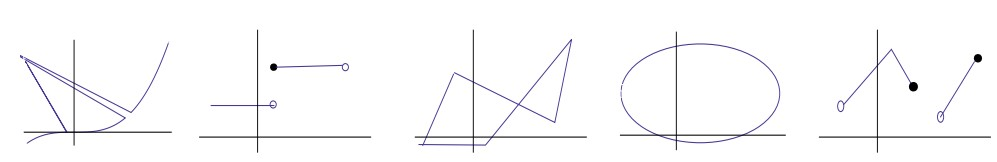
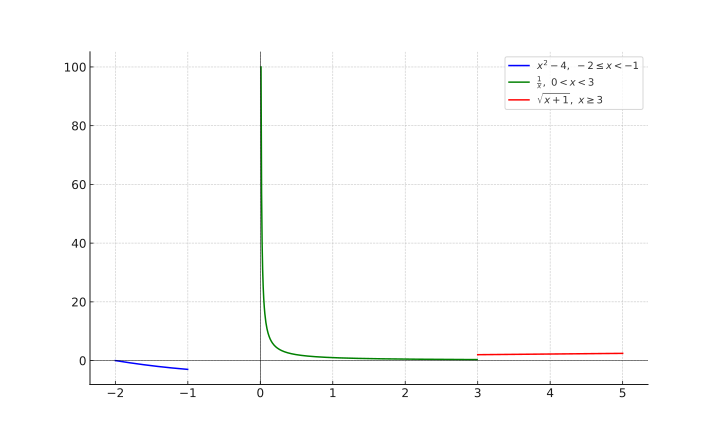

# Functions

## 1

Determine el dominio de las siguientes funciones:

### $f(x) = \frac{ \sqrt{ 2 x - 7 } }{ x^2 - 16 }$

1. $2 x - 7 \geq 0$.

    $$
    x \geq \frac{ 7 }{ 2 } \quad x \in \left [\frac{ 7 }{ 2 },\infty \right )
    $$

2. $x^2 - 16 \neq 0$.

    $$
    x \neq \pm \sqrt{ 16 } \quad x \neq 4 \quad x \neq -4
    $$

### $\frac{ x + 1 }{ x^4 + 2 x^2 - 3 }$

- $x^4 + 2 x^2 - 3 \neq 0$.

    $$
    y = x^2 \quad y^2 + 2 y - 3 \quad (y + 3) (y - 1) \neq 0 \\[10 pt]

    (x^2 + 3) (x^2 - 1) \neq 0 \\[10 pt]

    x \neq \pm \sqrt{ -3 } \quad \nexists \\[10 pt]

    x \neq \pm \sqrt{ 1 } \quad x \neq 1 \quad x \neq -1 \quad \mathbb{ R } - \{ 1,-1 \}
    $$

### $\sqrt{ \frac{ x - 3 }{ 1 - 2 x } }$

- $1 - 2x \neq 0$.

    $$
    x \neq \frac{ 1 }{ 2 } \quad \mathbb{ R } - \left \{ \frac{ 1 }{ 2 } \right \}
    $$

- $\frac{ x - 3 }{ 1 - 2 x } \geq 0$.

    1. $x - 3 = 0$.

        $$
        x = 3 \quad x \in \{ 3 \}
        $$

    2. $x - 3 > 0 \quad 1 - 2 x > 0$.

        $$
        x > 3 \quad x \in (3,\infty) \quad x < \frac{ 1 }{ 2 } \quad x \in \left (-\infty,\frac{ 1 }{ 2 } \right ) \\[10 pt]

        x \in \empty
        $$

    3. $x - 3 < 0 \quad 1 - 2 x < 0$.

        $$
        x < 3 \quad x \in (-\infty,3) \quad x > \frac{ 1 }{ 2 } \quad x \in \left (\frac{ 1 }{ 2 },\infty \right ) \\[10 pt]

        x \in \left (\frac{ 1 }{ 2 },3 \right )
        $$

$$
x \in \mathbb{ R } - \left \{ \frac{ 1 }{ 2 } \right \} \cap \left (\{ 3 \} \cup \empty \cup \left (\frac{ 1 }{ 2 },3 \right ) \right ) \quad x \in \left (\frac{ 1 }{ 2 },3 \right ]
$$

## 2

Sean $f(x) = \frac{ x + 1 }{ x - 1 }$ y $f(x) = \sqrt{ x + 1 }$.

### Calcule - 1

#### $f(2)$ ($f(x) = \frac{ x + 1 }{ x - 1 }$ y $f(x) = \sqrt{ x + 1 }$)

$$
\frac{ 2 + 1 }{ 2 - 1 } = 3 \quad \sqrt{ 2 + 1 } = \sqrt{ 3 }
$$

#### $f(\frac{ 3 }{ 2 })$

$$
\frac{ \frac{ 3 }{ 2 } + 1 }{ \frac{ 3 }{ 2 } - 1 } = \frac{ 10 }{ 2 } = 5 \quad \sqrt{ \frac{ 3 }{ 2 } + 1 } = \sqrt{ \frac{ 5 }{ 2 } }
$$

#### $f(0)$

$$
\frac{ 0 + 1 }{ 0 - 1 } = -1 \quad \sqrt{ 0 + 1 } = 1
$$

### Simplifique al máximo la expresión $\frac{ f(x + h) - f(x) }{ h }$ $h \neq 0$

#### $f(x) = \frac{ x + 1 }{ x - 1 }$

$$
\frac{ \frac{ (x + h) + 1 }{ (x + h) - 1 } - \frac{ x + 1 }{ x - 1 } }{ h } = \frac{ \frac{ ((x + h) + 1) (x - 1) - ((x + h) - 1) (x + 1) }{ ((x + h) - 1) (x - 1) } }{ h } \\[10 pt]

\frac{ -2 }{ x^2 + x h - 2 x - h + 1 }
$$

#### $f(x) = \sqrt{ x + 1 }$

$$
\frac{ \sqrt{ (x + h) + 1 }- \sqrt{ x + 1 } }{ h }
$$

### Encuentre todos los valores de $x \in D_f$ tales que $f(x) \geq 4$

#### $f(x) = \frac{ x + 1 }{ x - 1 }$ ($x \in D_f$ tales que $f(x) \geq 4$)

$$
\frac{ x + 1 }{ x - 1 } \geq 4
$$

1. $x - 1 > 0$.

    $$
    x > 1 \quad x \in (1,\infty) \\[10 pt]

    x + 1 \geq 4 (x - 1) \quad x - 4 x \geq -4 - 1 \quad x \leq \frac{ -5 }{ -3 } \quad x \in \left (-\infty,\frac{ 5 }{ 3 } \right ] \\[10 pt]

    x \in \left (1,\frac{ 5 }{ 3 } \right ]
    $$

2. $x - 1 < 0$.

    $$
    x < 1 \quad x \in (-\infty,1) \\[10 pt]

    x + 1 \leq 4 (x - 1) \quad x \geq \frac{ -5 }{ -3 } \quad x \in \left [\frac{ 5 }{ 3 },\infty \right ) \\[10 pt]

    x \in \left (1,\frac{ 5 }{ 3 } \right ]
    $$

$$
x \in \left (1,\frac{ 5 }{ 3 } \right ] \cup \left (1,\frac{ 5 }{ 3 } \right ] \quad x \in \left (1,\frac{ 5 }{ 3 } \right ]
$$

#### $f(x) = \sqrt{ x + 1 }$  ($x \in D_f$ tales que $f(x) \geq 4$)

$$
x + 1 \geq 0 \quad x \geq -1 \quad x \in (-1,\infty) \\[10 pt]

\sqrt{ x + 1 } \geq 4 \quad x + 1 \geq 16 \quad x \geq 15 \quad x \in [15,\infty) \\[10 pt]

x \in (-1,\infty) \cap [15,\infty) \quad x \in [15,\infty)
$$

## 3

Sea $f(x) = 1 - \sqrt{ \frac{ 3 }{ x^2 } + 1 }$. Determine si $6$ y $-4$ están en el rango de $f$.

$y \in R_f \iff \{ y \in C_f \; | \; f(x) = y,\exists x \in D_f \}$

- $6$.

    $$
    1 - \sqrt{ \frac{ 3 }{ x^2 } + 1 } = 6 \quad \sqrt{ \frac{ 3 }{ x^2 } + 1 } = -5
    $$

    Esa igualdad no es posible, porque una raíz cuadrada nunca puede dar un número negativo (al menos en los números reales).

- $-4$.

    $$
    1 - \sqrt{ \frac{ 3 }{ x^2 } + 1 } = -4 \quad \sqrt{ \frac{ 3 }{ x^2 } + 1 } = 5 \quad \frac{ 3 }{ x^2 } + 1 = 25 \\[10 pt]

    x^2 = \frac{ 3 }{ 24 } \quad x = \pm \sqrt{ \frac{ 1 }{ 8 } }
    $$

## 4

Determine el rango de las siguientes funciones:

### $f(x) = 4 + |x - 3|$

$$
|x - 3| \geq 0 \quad |x - 3| \in [0,\infty) \\[10 pt]

y_{ \text{min} } = 4 + 0 = 4 \quad R_f = [4,\infty)
$$

### $f(x) = \sqrt{ -x^2 + 6 x }$

$$
-x^2 + 6 x \geq 0 \quad -x (x - 6) \geq 0
$$

1. $-x \geq 0 \quad x - 6 \geq 0$.

    $$
    x \leq 0 \quad x \in [-\infty,0] \quad x \geq 6 \quad x \in [6,\infty) \\[10 pt]

    x \in \empty
    $$

2. $-x \leq 0 \quad x - 6 \leq 0$.

    $$
    x \leq 0 \quad x \in [0,\infty) \quad x \leq 6 \quad x \in (-\infty,6] \\[10 pt]

    x \in [0,6]
    $$

$$
x \in \empty \cup [0,6] \quad x \in [0,6] \\[10 pt]
$$

Como $f(x)$ es una función creciente $y_{ \text{min} } = { -x^2 + 6 x }_\text{min}$ y $y_\text{max} = { -x^2 + 6 x }_\text{max}$.

$$
y_{ min } = f(0) = f(6) = \sqrt{ 0 } = 0 \\[10 pt]

y_{ \text{max} } = f(3) = \sqrt{ -(3)^2 + 6 (3) } = 3 \\[10 pt]

R_f = [0,3]
$$

## 5

Determine si las siguientes gráficas corresponden a la gráfica de una función $y = f(x)$.

Podemos usar el criterio de la línea vertical para determinar si la gráfica corresponde a una función o no, si encontramos una línea que intercepta más de un punto, entonces diremos que no es una función.

> Un $x$ no puede tener más de una imagen asociada a él.

## 6

Dada la función $f$.

$$
f(x) =
    \left \{
        \begin{array}{lr}
        x^2 - 4         & -2 \leq x < -1 \\[10 pt]

        \frac{ 1 }{ x } & 0 < x < 3 \\[10 pt]

        \sqrt{ x + 1 }  & x \geq 3
        \end{array}
    \right .
$$

### Determine el dominio y rango de $f$

$$
D_f = [-2,-1) \cup (0, 3) \cup [3,\infty) = [-2,-1) \cup (0,\infty)
$$

$$
R_f = (-3,\infty)
$$

### Calcule - 2

#### $f\left (-\frac{ 3 }{ 2 } \right )$

$$
f\left (-\frac{ 3 }{ 2 } \right ) = \left (-\frac{ 3 }{ 2 } \right )^2 - 4 = -\frac{ 7 }{ 4 }
$$

#### $f(−1)$

$$
-1 \notin D_f
$$

#### $f(2)$

$$
f(2) = \frac{ 1 }{ 2 }
$$

#### $f(3)$

$$
\sqrt{ 3 + 1 } = 2
$$

#### $f(a + 3) \quad a > 0$

$$
a > 0 \quad a + 3 > 3
$$

$$
f(a + 3) = \sqrt{ (a + 3) + 1 } = \sqrt{ a + 4 }
$$

#### $f(−2 a) \quad a > 0$

$$
a > 0 \quad -2 a < 0 \\[10 pt]

-2 \leq -2a < -1 \\[10 pt]

\frac{ 1 }{ 2 } < a \leq 1 \quad \left (\frac{ 1 }{ 2 }, 1 \right ] \\[10 pt]

\forall a \in \left (\frac{ 1 }{ 2 }, 1 \right ] \quad f(−2 a) = 4 a - 4 = 4 (a - 1)
$$

### Grafique $f(x)$

## 7

Un recipiente rectangular sin tapa tiene volumen de $20 \text{m}^3$ , la longitud de su base es el doble de su ancho. El material para la base cuesta $6$ dólares por metro cuadrado y para las caras $4$ dólares. Exprese el costo del material como función del ancho de la base. Indique el dominio de la función.

$$
a = a \quad b = 2 a \quad \text{volumen} = a b h = v \quad h = \frac{ v }{ a b } = \frac{ v }{ 2 a^2 } \\[10 pt]

\text{costo} = 2 (4 a h) + 2 (4 b h) + 6 b a = 4 \frac{ v }{ a } + 8 \frac{ v }{ a } + 12 a^2 = \frac{ 12 ( v + a^3) }{ a } = \frac{ 12 ( 20 + a^3) }{ a } \quad D_f = (0,\infty)
$$

## 8

Se debe construir una caja abierta a partir de un trozo rectangular de cartón, de $12$ pulgadas de ancho y $20$ pulgadas de largo, recortando cuadrados de lados iguales $x$ en cada una de las esquinas y doblando los lados. Exprese el volumen de la caja en función de $x$, indicando su dominio.

$$
\text{volumen} = a l h = v \quad h = x \quad l = 20 - 2 x \quad a = 12 - 2 x \\[10 pt]

v = (12 - 2 x) (20 - 2 x) x = 4 x^3 - 64 x^2 + 240 x \\[10 pt]

4 x^3 - 64 x^2 + 240 x > 0 \quad x^3 - 16 x^2 + 60 x > 0 \\[10 pt]

x (x - 6) (x - 10) > 0
$$

Hay que probar los casos donde este producto es positivo.

> Este número es $C_{ 3,2 } + 1 = 4$.

1. $x > 0$, $x - 6 > 0$ y $x - 10 > 0$.

    $$
    x > 0 \quad x > 6 \quad x > 10 \quad x \in (10,\infty)
    $$

2. $x > 0$, $x - 6 < 0$ y $x - 10 < 0$.

    $$
    x > 0 \quad x < 6 \quad x < 10 \quad x \in (0,6)
    $$

3. $x < 0$, $x - 6 < 0$ y $x - 10 > 0$.

    $$
    x < 0 \quad x < 6 \quad x > 10 \quad x \in \empty
    $$

4. $x < 0$, $x - 6 > 0$ y $x - 10 < 0$.

    $$
    x < 0 \quad x > 6 \quad x < 10 \quad x \in \empty
    $$

$$
x \in (10,\infty) \cup (0,6) \cup \empty = (0,6) \cup (10,\infty)
$$

## 9

Un cilindro circular recto de radio $r$ está inscrito en una esfera de radio $2 r$. Determine una fórmula para el volumen $V$ del cilindro en términos de $r$.

$$
\text{volumen} = \pi r^2 h = v \\[10 pt]

h^2 = (4 r)^2 - (2 r)^2 \quad h = \sqrt{ 12 r^2 } = 4 \sqrt{ 3 r^2 } \\[10 pt]

v = 4 \pi r^2 \sqrt{ 3 r^2 }
$$

## 10

Uno de los catetos de un triángulo rectángulo tiene longitud $6 \text{cm}$. Exprese la longitud de la altura perpendicular a la hipotenusa como función de la longitud de la hipotenusa.

$$
A = \frac{ 1 }{ 2 } 6 b \quad A = \frac{ 1 }{ 2 } c h \\[10 pt]

h^2 = 6^2 + b^2 \quad b = \sqrt{ h^2 - 36 } \\[10 pt]

\frac{ 1 }{ 2 } 6 b = \frac{ 1 }{ 2 } c h \\[10 pt]

h = \frac{ 6 \sqrt{ c^2 - 36 } }{ c }
$$
