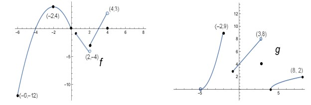

# Functions

## 1

Considere las graficas de las funciones $f$ y $g$.

1. Determine el

    - dominio de $g$:

        $$
        D_g = (-5,-2] \cup [-1,3] \cup [4,8]
        $$

    - rango de $f$.

        $$
        R_f = [-12,4]
        $$

2. Calcule

    - $(f + g)(0)$.

        $$
        f(0) + g(0) = 0 + 4 = 4
        $$

    - $(f g)(-2)$.

        $$
        f(-2) * g(-2) = 4 * 9 = 36
        $$

    - $(f o g)(8)$.

        $$
        f(g(8)) = f(2) = -3
        $$

    - $(g o g)(3)$.

        $$
        g(g(3)) = g(4) = 0
        $$
