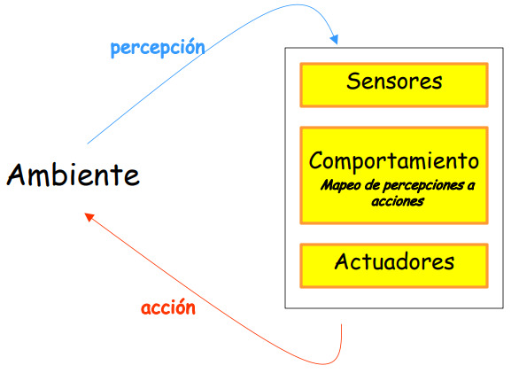

# Agents

## Agente

Es todo aquello que puede considerarse que percibe su ambiente mediante **sensores** y que responde o actúa por medio de **efectores**.

### Racional

Es aquel que **hace lo correcto**, es decir, aquello que le permite obtener un buen desempeño de acuerdo a una meta específica.

> La racionalidad está relacionada con el éxito esperado, tomando como base lo que se ha percibido.

---

Existen cuatro tipos de agentes, presentados en orden creciente de inteligencia, son:

1. Reflejo simple.

2. Con modelo del entorno.

3. Basado en metas.

4. Basado en utilidad.

#### De reflejo simple

A cada percepción se le asocia una acción a efectuar. El conocimiento se representa mediante una tabla.

> Ante una percepción dada el agente actúa siempre de la misma forma.

#### Con modelo del entorno

A cada situación del entorno se le asocia una acción. Al igual que el de reflejo simple, el conocimiento se representa mediante una tabla, pero esta tendrá más campos cubriendo las situaciones posibles.

$$
\text{situación del entorno} = f(\text{percepciones }, \text{datos anteriores}) \\[10 pt]

\text{acción} = g(\text{situación del entorno})
$$

Puede utilizar cualquier estructura de datos para crear el modelo del entorno. A diferencia del agente de reflejo simple, una misma percepción puede dar lugar a acciones distintas.

> Si existen varias alternativas, no existe un criterio para escoger.

#### Basado en metas

Se tienen dos nuevos elementos:

- Meta: estado final deseado en el sistema.

- Modelado del efecto de las acciones: a cada par $(\text{estado},\text{acción})$ se le asocia un efecto.

Este agente no tiene en cuenta el costo de la solución (si es que encuentra una), pero reduce el espacio de búsqueda.

> Entiéndase costo como la puntuación de una solución.

En caso de empate, el agente utiliza el **modelo**. En el caso de búsqueda se escoge el camino que no haya sido explorado.

##### Ejemplo (agente basado en metas)

Tenemos un ratón que está en un laberinto y quiere comerse el queso.

Podemos usar la "distancia en $L$" para modelar el efecto de las situaciones. La distancia en $L$ para cualquier un punto $(x,y)$ corresponderá a lo siguiente:

$$
L(x, y) = | Q_x - x | + | Q_y - y |
$$

> $Q_x$ y $Q_y$ corresponden a la abscisa y ordenada del queso respectivamente.

Esta distancia puede verse como la suma de la longitud de los catetos del triángulo rectángulo que se forma con una posición cualquiera y la posición del queso.

#### Agente basado en utilidad

A diferencia del agente basado en metas, este agente encuentra la solución óptima según el costo en vez de una solución que simplemente consiga alcanzar la meta o estado ideal. Se define un **valor de utilidad** para cada estado.

## Propiedades de los ambientes

- Accesibilidad: si los sensores de un agente pueden tener acceso al **estado total** de un ambiente, se dice que este es accesible.

- Determinismo: si el estado siguiente de un ambiente se determina mediante el **estado actual** y la **acción escogida**, se dice que el ambiente es determinista.

- Episodicidad: si la calidad de la actuación de un agente **no** depende de episodios anteriores, décimos que es episódico.

- Estáticos y dinámicos: si existe la posibilidad de que el ambiente sufra modificaciones mientras el agente se encuentra deliberando, se dice que se comporta en forma dinámica o es dinámico.

- Discretos y continuos: si existe una cantidad limitada de percepciones y acciones claramente discernibles, se dice que el ambiente es discreto.
