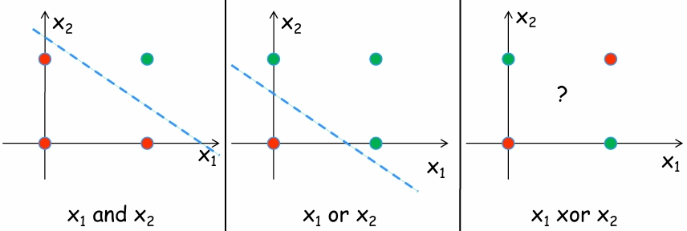

# Machine learning

Es una disciplina de la inteligencia artificial que a través de algoritmos le da a los computadores la capacidad de identificar patrones en datos masivos y elaborar predicciones.

> Patrones potencialmente útiles y no obvios.

```MERMAID
flowchart TB
    data(datos) -- selección ---> target_data(datos objetivos)

    target_data -- limpieza --> processed_data(datos procesados)

    processed_data -- preprocesamiento --> transformed_data(datos transformados)

    transformed_data -- data mining --> models(modelos)

    models -- interpretación --> knowledge(conocimiento)
```

## Técnicas principales

### Clustering

**Divide un conjunto de datos en grupos**
 de tal forma que los elementos en un grupo sean similares y los elementos en grupos diferentes tengan la menor similitud posible.

### Clasificación

Técnica que permite obtener modelos predictivos dado un conjunto de entrenamiento que se caracteriza por tener unas **variables independientes** y una **variable dependiente** o **etiqueta de clase**.

### Reglas de asociación

Dado un conjunto de registros, encontrar reglas que **predecirán la ocurrencia** de un ítem, basándose en las ocurrencias de los otros ítems en el registro.

### Patrones de secuencia

Dado un conjunto de objetos, cada uno asociado con su propia línea de tiempo (eventos), encuentra reglas que predicen dependencias fuertes entre diferentes eventos.

## Redes neuronales

Las redes neuronales artificiales son una técnica inspirada en el sistema nervioso humano que permite obtener **modelos predictivos**.

### Características (redes neuronales)

- Aprendizaje adaptativo: aprender mediante un proceso de entrenamiento.

- Capacidad de generalización: predecir correctamente casos de prueba que son muy diferentes a los de entrenamiento.

### Estructura de una neurona


$$
U = \sum_{ i = 1 }^n { x_i w_{ iu } }
$$

> Donde $U$ corresponde a la entrada enta de la neurona.

A la entrada neta se le aplica una función de activación ($y_u = f(U)$) para conocer la salida de la neurona.

### Funciones de activación

#### ReLu (Rectifies Lineal Unit)

Aplica una transformación no lineal muy simple, activa la neurona solo si la entrada está por encima de cero.

$$
\operatorname{ ReLu }(x) = \operator{ max }(x,0)
$$

#### Sigmoide

Transforma valores en el rango de $(-\infty,\infty)$ a valores en el rango $(0,1)$.

### Red perceptrón

Son redes neuronales que solo tienen **capa de entrada** y **capa de salida**, es decir, no tienen capas intermedias u ocultas. Es capaz de representar una función solo si existe una línea que separe los patrones de dos clases dadas.



### Red perceptrón multicapa

Son redes neuronales que tienen una o varias capas ocultas y que permiten modelar más problemas que las redes perceptrón simples.

### Codificación de variables categóricas

Las redes neuronales solo manejan entradas y salidas de tipo numérico. Si los datos contienen valores categóricos, estos se deben transformar usando alguna estrategia.

#### Label encoding

Se reemplaza un atributo categórico por un número según los valores que puede tomar dicha variable.

#### One hot encoding

Se crea una columna para cada valor distinto que exista en un atributo categórico.

### Normalización de los datos

La normalización de los datos se hace con el fin de asegurar una comparabilidad entre atributos o variables. Al normalizar los datos, se asegura que todas las características tienen una influencia similar en el entrenamiento, lo que permite a la red neuronal aprender relaciones más significativas y no estar sesgada hacia características con valores mayores.

### Validación cruzada (cross-validation)

Es una técnica utilizada para evaluar los resultados de un modelo predictivo y garantizar que sean independientes de la partición entre datos de entrenamiento y de prueba.

#### Aplicacion (cross-validation)

1. División de datos: el conjunto de datos se divide en $k$ partes (o folds) de aproximadamente el mismo tamaño.

2. Entrenamiento y validación.

    Para cada una de las $k$ iteraciones:

    - Se toma uno de los $k$ folds como conjunto de validación.

    - Los $k - 1$ folds restantes se usan como conjunto de entrenamiento.

    - Se entrena el modelo con el conjunto de entrenamiento y se evalúa su rendimiento en el conjunto de validación.

3. Se promedian los resultados de las $k$ iteraciones para obtener una medida general del rendimiento del modelo.

### Error medio absoluto (MAE)

Es una medida de la diferencia entre dos variables continuas, en este caso, entre los valores que predice el modelo y los valores reales.

$$
\text{MAE} = \frac{ 1 }{ N } \sum_{ i = 1 }^N | y_i - \hat{ y }_i |
$$

### Matriz de confusión

Es una herramienta utilizada en el análisis de clasificación para evaluar el rendimiento de un modelo de aprendizaje automático. Permite visualizar el desempeño del algoritmo de clasificación, mostrando no solo cuántas predicciones fueron correctas, sino también los tipos de errores cometidos.

$$
\begin{array}{c|cc}
    & \text{negative ($0$)} & \text{positive ($1$)} \\
    \hline
    \text{negative ($0$)} & \text{TN (true negative)} & \text{FP (false positive)} \\
    \text{positive ($1$)} & \text{FN (false negative)} & \text{TP (true positive)} \\
\end{array}
$$

### Precisión

La precisión o **accuracy** indica la cantidad correcta de predicciones (positivas o negativas) sobre el total de datos.

$$
\text{accuracy} = \frac{ \text{TP} + \text{TN} }{ \text{TP} + \text{TN} + \text{FP} + \text{FN} }
$$
