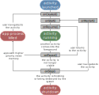

# Introduction

## Componentes de una aplicación

### View

Son los elementos que componen la interfaz de usuario de una aplicación: por ejemplo, un botón o una entrada de texto, Todas las vistas van a ser objetos descendientes de la clase View.

### Layout

Es un conjunto de vistas agrupadas de una determinada forma. Hay diferentes tipos de layouts para organizar las vistas. Los layouts también son objetos descendientes de la clase View.

### Activity

En Android, cada una de las pantallas, se conoce como actividad. Su función principal es la creación de la interfaz de usuario. Una actividad utiliza un layout para definir su apariencia.

### Fragment

Representa una parte reutilizable de la IU de tu app, Un fragmento define y administra su propio diseño y su propio ciclo de vida. Los fragmentos no pueden existir por sí solos, deben estar alojados en una actividad u otro fragmento.

### Service

Es un proceso que se ejecuta en segundo plano, sin la necesidad de una interacción con el usuario. Se utilizan cuando queramos tener en ejecución un código de manera continua, aunque el usuario cambie de actividad.

### Intent

Se utiliza cada vez que queramos realizar una acción, como ir de una actividad a otra, lanzar un servicio, realizar una llamada.

### Broadcast receiver

Es un componente destinado a detectar y reaccionar ante determinados eventos, por ejemplo, cuando se apaga la pantalla, que el nivel de carga de la batería es bajo.

### Content provider

Permite compartir datos entre aplicaciones. Mediante estos componentes es posible compartir determinados datos de nuestra aplicación sin mostrar detalles sobre su almacenamiento inteno, su estructura, o su implementación.

## Ciclo de vida de una actividad

