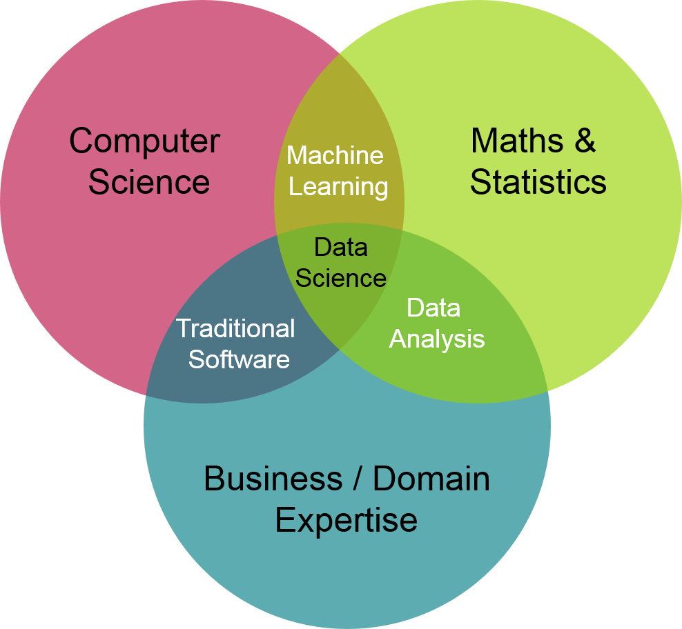
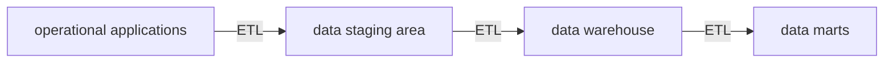
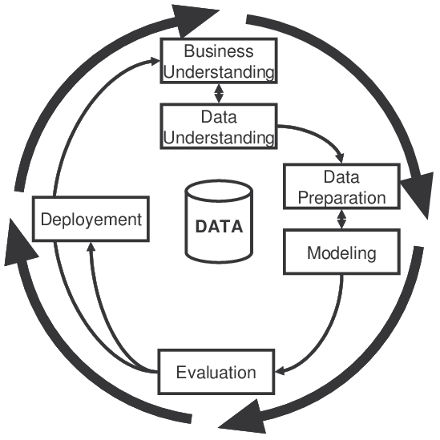

# Introduction

## ¿Qué es Big Data?

```MERMAID
mindmap
    root((Big Data))
        volume
        velocity
        variety
        veracity
        value
```

Entre sus características encontramos:

- Diferentes grados de **complejidad**, **ambigüedad** en los datos.

- No puede ser procesado utilizando tecnologías **tradicionales**.

## Data science

La ciencia de datos combina las matemáticas y la estadística, la programación especializada, el análisis avanzado, la inteligencia artificial y el machine learning con conocimientos específicos en la materia para descubrir conocimientos procesables ocultos en los datos de una organización.



## Business intelligence

Integración y tratamiento de los **datos** para **convertirlos** en **información** que permita apoyar a los tomadores de decisiones en la organización.

## Data warehouse



> ETL son las siglas de extraction, transformation y load.

### Componentes

1. Sistemas operacionales fuentes (operation source system).

    La fuente de los datos que se desean integrar y generalmente son sistemas legados que manejan la información con tecnología heterogénea.

    > Un sistema legado es un sistema informático o una aplicación de software que sigue en uso dentro de una organización, pero que fue desarrollado con tecnologías, lenguajes de programación o plataformas que ya están obsoletas o discontinuadas.

    > Las tecnologías heterogéneas se refieren a un conjunto de tecnologías que, aunque son diferentes en su origen, diseño, o funcionamiento, se combinan o se utilizan juntas para cumplir un objetivo común.

2. Área de preparación de datos (data staging area).

    Herramientas ETL.

3. Área de presentación de datos (data presentation).

    Donde la información se organiza, almacena y se hace disponible para los usuarios. El área de presentación de datos frecuentemente se representa mediante un conjunto de **data marts** que están integrados.

4. Herramienta de acceso a los datos (visualización).

    Se ofrecen herramientas a los usuarios para hacer consultas, sacar reportes, imprimir informes.

## ETL

### Extraction

Leer y entender los datos de diferentes fuentes. También se copian los datos que se usarán para ser manipulados posteriormente.

### Transformation

Se resuelven conflictos entre los datos de dominio, se trata con elementos perdidos o faltantes o se mapea los datos a formatos estándares.

### Load

Se guardan los datos en el **data warehouse**, por lo general corren procesos que insertan datos en las dimensiones y las tablas de hechos.

## Online Transation Processing (OLTP) vs. Online Analytical Processing (OLAP)

|      OLTP       |                  OLAP                  |
|:---------------:|:--------------------------------------:|
| actualizaciones | lecturas, consultas complejas y largas |
| datos vigentes  |         información histórica          |

## Data mining

Also known as knowledge discovery in data (KDD), is the process of **uncovering patterns** and other valuable information from large data sets.

Data warehousing technology and the adoption of data mining techniques assist companies by transforming their **raw data** into **useful knowledge**.

[data mining process](../../../07/Inteligencia_artificial/07-machine_learning.md#machine-learning)

## Metodología CRIPS-DM


