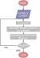

# Data mining - clustering

Es el proceso de dividir un conjunto de datos en subconjuntos. Cada subconjunto es un grupo, de modo que los objetos de un grupo son **similares** entre sí, pero **diferentes** a los datos de otros grupos.

> A estos grupos les llamamos **clústeres**.

Cuando vamos a aplicar este tipo de técnicas, tenemos que proveer el número de clústeres y el número de iteraciones. Podemos decir que el modelo arrojó buenos resultados (clústeres de calidad) si hay:

- **Alta** similitud entre datos de la misma clase.

- **Baja** similitud entre datos de diferentes clases.

> Por lo tanto, la **calidad** dependerá de la medida de similitud que se utilice.

## Similitud entre objetos

### Distancia euclidiana

En general, la distancia euclidiana entre los puntos

$$
P = (p_1,p_2,\dots,p_n) \quad Q = (q_1,q_2,\dots,q_n)
$$

está dada por

$$
d(P,Q) = \sqrt{ (p_1 - q_1)^2 + (p_2 - q_2)^2 + \dots + (p_n - q_n)^2 } = \sqrt{ \sum_{ i = 1 }^n (p_i - q_i)^2 }
$$

### Similitud coseno

$$
\cos(\theta) = \frac{ A \cdot B }{ ||A|| ||B|| } = \frac{ \sum_{ i = 1 }^n { A_i B_i } }{ \sqrt{ \sum_{ i = 1 }^n { A_i }^2 } \sqrt{ \sum_{ i = 1 }^n { B_i }^2 } }
$$

Podemos encontrarnos tres casos:

1. $\theta \to 0$: $\cos(\theta) \to 1$ (vectores similares).

2. $\theta \to 90\degree$: $\cos(\theta) \to 0$ (vectores ortogonales).

3. $\theta \to 180\degree$: $\cos(\theta) \to -1$ (vectores opuestos).

## Tipos

### Basado en centroides

El clustering basado en centroides es un tipo de método de clustering que divide o divide un conjunto de datos en grupos similares en función de la distancia entre sus centroides. El centroide de cada clúster es la media o la mediana de todos los puntos del clúster, en función de los datos.

#### Método de las K-medias

El método asume que el centro de cada clúster define el clúster utilizando una medida de distancia, normalmente la distancia euclidiana, al centroide. Para inicializar el clustering, se proporciona un número de clústeres esperados, que representa la $K$ medias, y el algoritmo intenta encontrar clusters razonables a través de los datos para que coincidan con ese número. Los $k$ clústeres óptimos de un conjunto de datos determinado se identifican minimizando de forma iterativa la distancia total entre cada punto y su centroide de clúster asignado.

### Jerárquicosa

El clustering jerárquico, a veces denominado clustering basado en la conectividad, agrupa los puntos de datos en función de la proximidad y la conectividad de sus atributos. No es necesario especificar previamente el número de clústeres. En su lugar, el algoritmo de clustering crea una red de grafos de los clústeres en cada nivel jerárquico. Esta red es jerárquica, lo que significa que cualquier nodo dado en ella solo tiene un nodo principal, pero puede tener varios nodos secundarios. Los clústeres jerárquicos se pueden representar gráficamente con un dendrograma para ayudar a resumir y organizar visualmente los clústeres detectados y la jerarquía que pueden contener.

> Existen dos enfoques para realizar el análisis jerárquico de clústeres.

#### Aglomeración

Es un enfoque ascendente que comienza con puntos de datos individuales y fusiona sucesivamente los clústeres, calculando la matriz de proximidad de todos los clústeres en el nivel actual de la jerarquía para crear una estructura similar a un árbol.

### Basados en densidad

El clustering basado en la densidad funciona mediante la detección de áreas donde se concentran puntos y donde están separados por áreas que están vacías o escasas. El clustering basado en la densidad también puede distinguir entre los puntos de datos que forman parte de un clúster y los que deben etiquetarse como ruido. El clustering basado en la densidad es especialmente útil cuando se trabaja con conjuntos de datos con ruido o valores atípicos o cuando no tenemos conocimiento previo sobre el número de clústeres en los datos.
