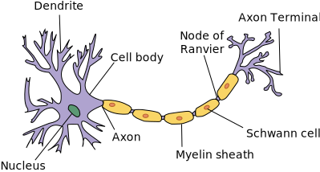

# Brief biological introduction

Un científico español llamado Santiago Ramón y Cajal, a finales del siglo XIX, logró descubrir que el cerebro humano estaba compuesto de una red de células llamadas neuronas, cuya estructura sigue la siguiente:

- Dendritas: reciben y procesan la información entrante.

- Soma (o el núcleo): es la unidad de procesamiento básica, con un tamaño de $10 * 10^{ -6 } \text{m}$ a $80 * 10^{ -6 } \text{m}$ (micras).

- Axón: es el canal de salida de la información.

> Del soma llega no una dendrita, sino que en realidad es un extenso árbol dendrítico.

## ¿Qué es un recuerdo?

De acuerdo con Fuster, [un recuerdo es un patrón de conexiones entre poblaciones de neuronas asociadas por la experiencia](https://ieeexplore.ieee.org/document/6793991). Esas neuronas ya hemos visto que se pueden encontrar dispersas en su zona local. Sería muy difícil decir que una sola neurona representa una acción o concepto (la granularidad de un concepto o recuerdo no es posible aquí). Lo que sí podemos decir, es que esas poblaciones de células representan las percepciones y acciones asociadas que, en conjunto, constituyen esa memoria o recuerdo cognitivo.

> La memoria es un sistema relacional, disperso y distribuido.

## ¿Dónde están los recuerdos?

No hay que confundir la visión modular del cerebro con el aislamiento. Por ejemplo, hay zonas del cerebro que tienen más influencia sobre la memoria que otras. Sin embargo, los conocimientos se superponen y se interconectan profusamente.
